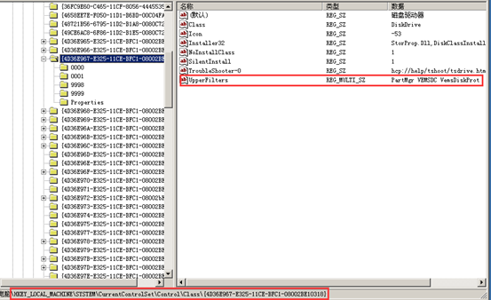

<blockquote class="success">
	常见问题和部分软件迁移
</blockquote>  

|  步骤  | 现象   |
| --- | --- |
|   1、 |为什么在打开用友OA系统时会等待很久才能进入  |
|  |<blockquote class="info">检查计算机名是否为纯数字，如果是则添加终端前缀名 </blockquote>  |
|2、  |为什么安装我们客户端程序重启后，会出现wdf01000.sys蓝屏情况，蓝屏代码为0x000000D1  |
|  |<blockquote class="info">出现这问题请检查客户机操作系统安装了intel管理驱动，如果有请卸载。该驱动会引起teeDriver驱动蓝屏。Intel Management Engine即Intel管理引擎，是一个用于管理Intel芯片组各种周边功能的一个接口，通过该接口能实现电源管理及如Intel AMT（Active Management Technology）主动管理技术等高级功能。卸载不影响其它驱动 </blockquote>   |
| 3、 |  为什么超级管理模式下终端正常，普通用户下使用十几分钟左右后出现各种随机蓝屏情况（蓝屏代码随机）|
| |<blockquote class="warning">出现该问题可能是因为某软件修改了注册表中影响我们终端运行的键值，我们可以通过注册表查看。出现该问题我们首先检查终端注册表  [HKEY_LOCAL_MACHINE\SYSTEM\CurrentControlSet\Control\Class\{4D36E967-E325-11CE-BFC1-08002BE10318}]下的Upperfilters下面的键值是否被修改，一般情况会绑定我们VEMSDC和VemsDiskprot两个驱动。如下图所示; </blockquote> |
| | |
| |<blockquote class="warning">如果该键值被修改或去掉，会引起各种蓝屏情况 </blockquote>  |
| | |