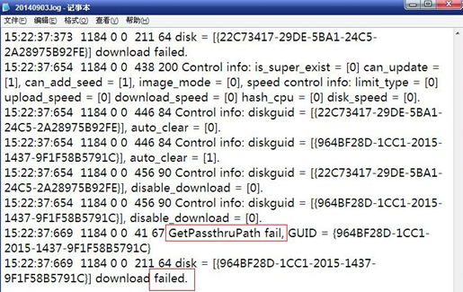

<blockquote class="success">
同一个磁盘中有两个或两个以上镜像，为什么下载完成第一个镜像后，第二个镜像无法下载？
</blockquote>   

|  步骤  | 问题   |
| --- | --- |
|   1、 |同一个磁盘中有两个或两个以上镜像，为什么下载完成第一个镜像后，第二个镜像无法下载？ |
|  | <blockquote class="default">出现该问题，首先我们从终端客户端目录下vemsdiskclient日志(p:\Program Files\VENGD\vemsdiskclient\)分析，如下图所示：</blockquote> |
|  |  |
|  | <blockquote class="default">通过上图，我们可以看到上面日志，上面Getpassthrupath fail提示获取穿透路径失败，下面download  failed提示下载失败。通过上面两个日志，请检查缓存分区空间是否己满；如果空间足够，请检查终端的硬盘是否正常 </blockquote> |
|  |<blockquote class="success">注：请保证缓存分区空间大小为系统镜像大小的2倍加1，依次类推，如果是两个镜像，缓存分区空间大小应为（两个镜像之和）*2+2。></blockquote>  |
|2、  |  为什么终端按HOME键进入下载镜像，中途提示下载失败？|
|  | <blockquote class="default">出现这个问题后从以下几个方面入手检查： 1、请检查当前终端连接的种子机器是否关闭，如果有请重启终端断点续传下载； 2、如果当前终端直接从服务器下载镜像，请检查服务器是否正常运行；
</blockquote> |
|  |  |