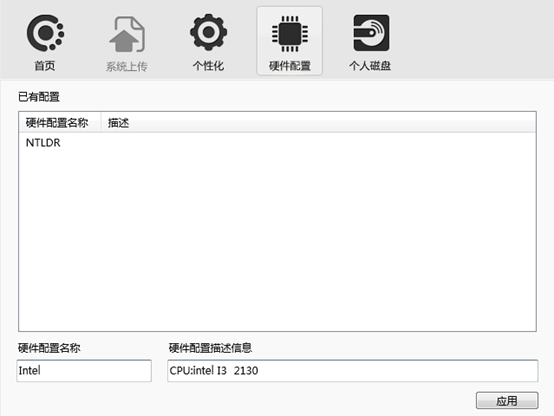
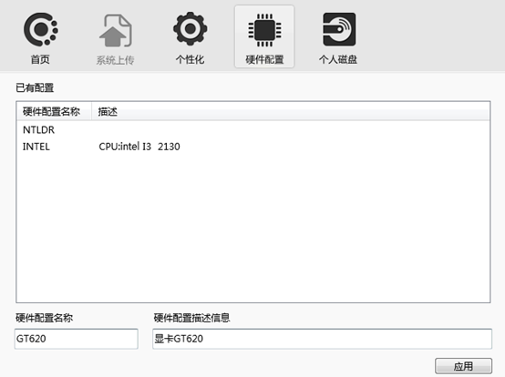

<blockquote class="success">
1、如何创建多硬件配置策略
</blockquote> 

>前提: 将服务端在服务器上安装、配置完毕

|序号|操作|
|---|---|
|1）|	选择客户机A安装操作系统（建议选择原版操作系统）；|
|2）|	操作系统安装完毕后安装客户机A网卡驱动（只安装网卡驱动）；|
|3）|	安装客户端上传操作系统；|
|4）|	上传完毕后网络启动客户机A；||
|5）|	启动并网络引导客户机B|
|6）|	连接服务器并输入编号|
|7）|	打开控制台，进入[系统]菜单[网络PNP]选项打开网络PNP对话框，选择[更新]，详情请参考第四部分第十九章 管理端-网络PNP管理；|
|8）|	更新完毕后，重启客户机B启动进入操作系统；|
|9）|	设置客户机A为超管，安装多硬件配置支持驱动（参考第五部 第三章 如何保存硬件配置）；|
|10）|在客户端操作界面上选择[硬件配置]，输入硬件配置文件名与描述，如下图；|
|||
||保存成功后，控制台自动生成硬件配置策略：INTEL；|
|11）|关闭客户机A，保持超管状态，将客户机A移动到INTEL 硬件配置策略中；|
|12）|启动客户机A开始安装主板、显卡、声卡等驱动；|
|13）|<blockquote class="success">安装客户机A驱动完毕后，关机并取消超管</blockquote>  客户机A硬件配置完毕；下面开始客户机B硬件配置； 1）	设置客户机B为超管并启动进入系统； 2）	右键客户端[保存硬件配置]，输入客户机B硬件配置名称与描述（该描述方便后续查看）如下图；|
|||
||保存成功后，控制台自动生成硬件配置策略：GT620； 3）	关闭客户机B，保持超管状态，将客户机B移动到GT620硬件配置策略中； 4）	启动客户机B开始安装主板、显卡、声卡等驱动 5）	安装客户机B驱动完毕后，关机并取消超管即可完成客户机B的硬件配置|
||<blockquote class="warning">提示：将网络中与客户机A、B相同类的客户端机器移动到对应的硬件配置策略即可实现同镜像多硬件配置；</blockquote> |

  
<blockquote class="success">
2、如何删除多硬件配置策略
</blockquote> 

> 多硬件配置策略由于是对多种硬件配置的客户端机器进行兼容性整合，所以要删除多硬件配置策略，需要满足以下2个条件：
 
|序号|描叙|
|---|---|
|1）|	要删除的多硬件配置下没有客户机|
|2）|	超管在线且不在要删除的硬件配置下|

  

* * * * *

<blockquote class="success">
场景
</blockquote> 

> 服务器一台，客户机两台（客户机A与客户机B）

<blockquote class="success">
环境条件
</blockquote> 

> 客户机A与客户机B硬件配置不同（暂为同一平台，如intel平台）

<blockquote class="info">
主要硬件参数描述
</blockquote> 

1、服务器：
|硬件|版本|
|---|---|
|Cpu|Intel系列|
|内存|DDR3 1333 4G|
|硬盘|SATA2 500G|
|网卡|集成千兆网卡|
 
	

2、网络：
|硬件|版本|
|---|---|
|交换机|千兆交换机| 
	
 
3、客户机A 、客户机B

|硬件|版本|硬件|版本|
|---|---|---|---|
|Cpu|Intel系列|Cpu|Intel系列|
|内存|DDR3 1333 2G	|内存|DDR3 1333 2G|
|硬盘|Sata2 320G|硬盘|	Sata2 320G|
|网卡|Intel pro1000|网卡|Ret 8168|
|主板芯片组|G31系列|主板芯片组|G41系列|
