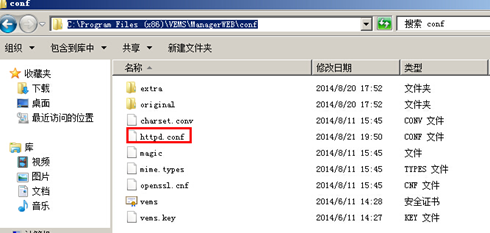
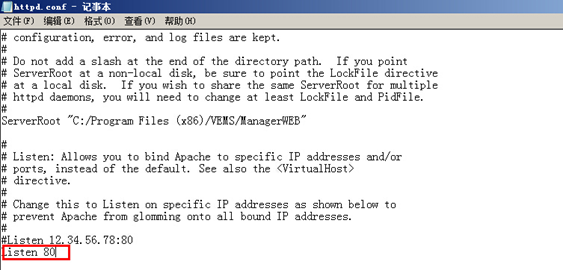
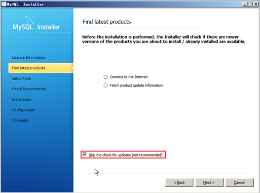

<blockquote class="success">
安装过程常遇到的一些问题问题
</blockquote>  

|  步骤  | 问题   |
| --- | --- |
|   1、 |在虚拟系统中安装软件时需要注意什么 |
|   |  <blockquote class="default"> 和信虚拟系统与由硬盘启动的系统基本上没有区别，但需要注意本系统底层是由网络支撑，所以注意尽量不要在虚拟系统中安装与网络相关的软件（如网络防火墙）。如果一定有这种软件安装需求则先在普通用户模式下安装测试是否正常，然后再到超管下安装</blockquote> |
|   2、 | 服务器可以安装其它软件吗|
|   |  <blockquote class="default"> 不要在服务器上安装其它软件以免影响服务器性能，特别是Wireshark之类的抓包工具，它们会带一些网络过滤驱动，所有的网络数据包都要经过这些驱动过滤后才能够到达应用层，可能会严重的影响数据包的收发效率</blockquote> |
|   3、 | 安装服务端或客户端时提示某磁盘不是NTFS格式，如何解决|
|   |  <blockquote class="default"> 将这些磁盘的格式转成NTFS即可。如果磁盘中没有重要的数据可以直接将它格式化，然后在格式化时选择NTFS格式；如果磁盘中有重要数据或是操作系统盘时，在命令提示符中使用DOS命令“convert 盘符: /fs:ntfs /x”即可</blockquote> |
|   4、 |为什么在安装服务端时会提示“请选择正确的网卡” |
|   |  <blockquote class="default"> 这种情况是因为服务器网卡IP地址被设置为动态获取，设置成固定IP即可</blockquote> |
|   5、 | 安装客户端时提示“检测到NVIDIA网络设备”并无法继续安装，如何解决？|
|   |  <blockquote class="default">出现这种提示的原因是终端网卡为NFOCE系列网卡，此网卡在虚拟化环境中性能与稳定性都极差，建议外插一块Intel PRO1000千兆网卡，然后在BIOS里屏蔽NFOCE网卡继续安装。 </blockquote> |
|  6、 |为什么终端通过网络引导选择本地硬盘启动，进入本地系统网卡驱动丢失？ |
|   |  <blockquote class="default">请检查该终端是否为NVIDIA网卡，如果是请再次安装NVIDIA网卡驱动即可。 </blockquote> |
|   7、 |为什么服务端安装完毕后，用浏览器登陆WEB端，提示登陆失败？ |
|   |  <blockquote class="default">请检查在安装服务端时填写的数据库信息是否正确。相关信息可通过注册表查看。找到注册表HKEY_LOCAL_MACHINE\SYSTEM\CurrentControlSet\Services\VEMSServer ，可查看安装服务端时所填写的数据库信息，如下图所示; </blockquote> |
|   8、 | 为什么安装完服务端后，用浏览器输入服务器IP地址登陆，提示无法访问？|
|   |  <blockquote class="default">出现这个问题后可从以下几个方面入手检查： 1、 检查服务器之前是否安装过相关的apache，如果有且和WEB端自带的apache版本不一致，请找到和信WEB服务端安装目录下httpd.conf配置文件修改apache默认端口; 操作如下：打开WEB服务端安装目录下conf文件夹，用记事本打开httpd.conf配置文件，如下图所示; 修改为其它未使用的端口后重启apache服务即可。 提示：修改apache端口后登陆和信WEB端格式如下：http://ip:修改后的端口。 2、如果之前安装的apahce和WEB端自带的apache版本一致，请卸载之前的apache后重新安装WEB端或更换服务器。 3、请检查服务端是否安装IIS且默认80端口是否被占用，如果有且端口被占用请修改apahce 默认80端口或停用iis，修改apache端口方法如上; 提示：修改apache端口后登陆WEB端格式如下：http://ip:修改后的端口。
 </blockquote> |
| 9、   | 为什么安装完MYSQL数据库和管理系统服务端，登陆WEB端后做任何设置都很反应延迟几秒|
|   |  <blockquote class="default">请检查服务器时间是否比服务端安装包时间要早，如果是请修改正确的服务器时间 </blockquote> |
|   10、 | 有多台服务器时如何部署？|
|   |  <blockquote class="default">在有多台服务器的环境时，先在第一台服务器上安装服务端和管理端，并按实施手册完成部署，然后在其它服务器上安装服务端，安装时集群名称使用同一个即可，系统会自动将配置、系统镜像等数据同步到新服务器上。 </blockquote> |
|   11、 |为什么通过移动硬盘部署时，在本地系统安装完客户端后，重启后终端会自动重启？ |
|   |  <blockquote class="default">出现该问题可能是因为本地系统之前安装了360安全卫士和其它一些安全软件，导致终端出现蓝屏情况自动重启了。 解决方法：重新启动本地系统，按F8恢复最后一次正确配置，然后进入本地系统卸载360安全卫士或其它一些安全软件，重新安装虚拟终端客户端即可。
 </blockquote> |
 | 12、|为什么在本地系统安装虚拟终端客户端后，按正常流程进入本地系统准备下载镜像时，终端右下角图标显示灰色未连接状态？ |
 | | <blockquote class="default">检查终端网卡驱动是否为感叹号，出现该种情况的终端一般为8139网卡。解决方法：更新网卡驱动，直接通过列表中的驱动进行更新即可 </blockquote>|
 |13、 | 为什么在安装MYSQL数据库时，会自动更新并且有时安装提示错误？|
 | |  <blockquote class="default">出现该问题一般情况是安装时没有勾选“skip the check for updates”，如下图所示</blockquote> |
 | | |
 | |  <blockquote class="default"></blockquote> | 
 | | |
 | |  <blockquote class="default"></blockquote> | 
 | | |
 | |  <blockquote class="default"></blockquote> | 
 | | |
 | |  <blockquote class="default"></blockquote> | 