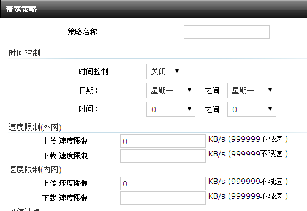

<blockquote class="success">
实施技巧
</blockquote>  
  

|  步骤  | 问题   |
| --- | --- |
|   1、 |如何通过减少新增硬件配置策略来提高实施过程中的工作效率？ |
|    | <blockquote class="default">在复杂的办公室环境以及一些特殊环境下，往往硬件配置不统一，如果我们部署时，把每种不同的硬件做一种硬件配置策略的话，既不能提高工作效率，又增加了没必要的硬件配置策略</blockquote>  |
||处理技巧： 1) 以品牌机为例平常部署时品牌机遇到比较多，往往我们都是以相同硬件做为一种硬件配置策略，其实可以把相接近的硬件可以放到同一种硬件配置策略中 如何判断哪些主板的芯片放到同一件硬件配置中兼容: 2) 可以通过CPU来分类。例：像intel 酷睿2 E4300到酷睿2 E8500之类的CPU，都可以放到一个硬件配置中，这类CPU上的主板芯片大部分兼容，安装好其中一个驱动后，其它终端机器的加入同一硬件配置中后驱动都可以自己搜索安装。 3) CPU来分类: 像奔腾双核E系列2140 2460等，酷睿2 E系列E4300 E E4400。。。。酷睿2 E8500等，AM2的CPU有3600+，4000+，5000+，6000+等，AM2+的CPU有7750,8450等，AM3的CPU有X240,X635等，相同类的做一种硬件配置，大部分是兼容的，如遇到特殊不兼容的可单独做个配置。|
|   2、 |在做多硬件配置前，我们应该如何处理才能提高一个镜像兼容多种不同硬件配置 |
|    | <blockquote class="default">1，安装一个纯净的系统，只安装网卡驱动和客户端进行上传。 2，收集部署环境中的所有显卡驱动，利用显卡PNP功能在做多硬件配置前把显卡驱动处理好。最新XP通用镜像包中集成了大量显卡PNP驱动，一般大部分旧品牌电脑的显卡驱动都可以正常驱起来。 3，处理ADM平台和INTEL平台不兼容问题。 4，处理IDE控制为标准双通道PCI IDE控制器。
</blockquote>  |
|   3、 | 在部署的环境安装了内网安全准入系统，终端安装了内网准入客户端，下载时无法从其它终端下载，如何让终端从服务器直接下载而不是从其它终端下载数据|
|    | <blockquote class="default">安装内网安全准入客户端后，我们一般情况是让用户把服务器加入准入例外列表里面，终端是正常可以和服务器进行访问的。而终端在没有登陆准入时，终端和终端之间是无法访问的，和信虚拟终端系统采用的是以64M为一个包节点以P2P机制从其它终端获得数据更新。当终端之间无法下载时，我们在部署时可以通过以下方法来解决下载的问题 在带宽策略里面的把内网上传限速设置为0，如下图所示; 
</blockquote> |
|   | |
|    | <blockquote class="default"></blockquote>  |
|   、 | |
|    | <blockquote class="default"></blockquote>  |
|   、 | |