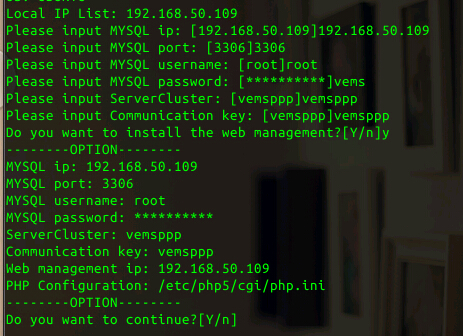

<blockquote class="success">
linux服务端相关安装和设置技巧
</blockquote>  

|  步骤  | 问题   |
| --- | --- |
|   1、 |如何将和信虚拟终端linux服务端安装包放到linux服务器中 |
|  |  可以在局域内架设FTP，可能用类似FtpServer之类的工具架设|
| 2、 |如何使用脚本安装服务端以及安装MYSQL数据库？  |
|  |  操作步骤如下： 1，用超级终端，进入解压的安装包目录，输入sudo -s进入管理员模式，输入当前用户密码，输入sh install.sh脚本会自动下载安装下列依赖包apache2,php5,php5-mysql,mysql-server,phpmyadmin。 安装过程中需正确配置MySQL密码，端口等相关设置，并正确配置服务端相关配置，如下图所示|
|  |  |
||按Y完成安装过程，安装完毕后重启服务器。|
| 3、 |配置MySQL，服务端安装完成后需对mysql进行相关配置，系统才能正常连接到数据库|
||(1)，mysql默认只绑定127.0.0.1，可以在[/etc/mysql/my.cnf]文件中注释[bind]以使绑定所有IP。 进入超级终端，用vi命令对my.cnf文件进行编辑，操作步骤如下：vi /etc/mysql/my.cnf如下图所示;|
||按“i”键进入编辑模式，更改当前127.0.0.1为本机服务器IP地址。更改完后按wq!保存即可。|
||| 

<blockquote class="warning">
注意:mysql默认只允许localhost登录，在mysql命令行中执行以下指令可允许所有主机使用root登录：操作步骤如下;
</blockquote>  

 >  输入mysql -uroot -p 进入mysql数据库，接着输入以下内容;
> mysql>update mysql.user set host="%" where User="root" and Host="localhost";
> mysql>flush privileges;

<blockquote class="success">
初始化数据库：mysql>source ve.sql(SQL表);
</blockquote>   
  完成MySQL配置后，重启服务器，即可正常连接到系统管理端，进行系统配置。
