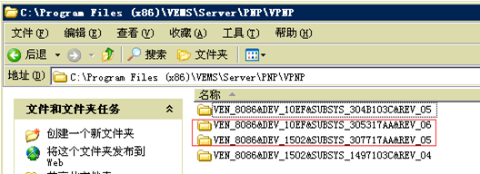
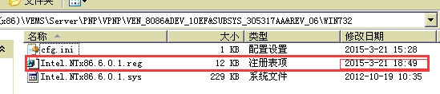
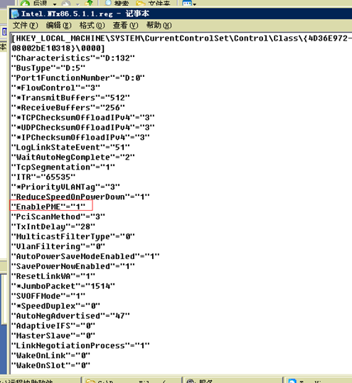

<blockquote class="success">
	管理员维护相关问题
</blockquote>  
   

|  步骤  | 问题   |
| --- | --- |
|   1、 |为什么新加入的终端在管理端上没有显示 |
|    | <blockquote class="default">新加入的终端需要在管理端刷新才能够显示</blockquote>  |
|  2、 |为什么管理端的终端列表中会自动出现新的终端 |
|    | <blockquote class="default">关闭【全局配置】中【自动编号】项即可</blockquote>  |
|  3、 |管理端【全局配置】中，修改【终端名前缀】后为什么已有终端的名称前缀未变 |
|    | <blockquote class="info">此设置只针对设置后再加入的终端有效</blockquote>  |
| 4、 |在管理端终端列表中，使用终端右键菜单的【启动终端】功能后此终端并未启动，无法远程唤醒终端是什么原因 |
|    | <blockquote class="default">请参考主板的使用手册打开网卡唤醒功能即可。另外部分网卡除了主板BIOS里要开启支持远程唤醒功能，还需检查系统网卡高级属性设置PME（电源管理）是否打开。启用PME操作步骤如下, 1，找到改网卡型号的硬件ID，在服务器PNP目录下找到相应硬件ID文件夹，如下图所示；2，找到对应网卡硬件ID后进去，选择注册表文件进行编辑，如下图所示；3，找到对应的PME选项，把键值改成“1”即可；
</blockquote>  |
|   |  <blockquote class="warning">注：有此高级网卡属性的设置一般为INTEL网卡。</blockquote>|
| 5、 |什么界面上显示离线的终端无法删除 |
|    | <blockquote class="default">请检查该客户机是否已经完全关机，如果已经完全关机还无法删除请耐心等待一段时间即可删除，因为控制台显示客户机已离线的时候，系统与客户机的连接可能还没有完全断开，等待一段时间即可</blockquote>  |
|  6、 |什么是帐号权限管理 |
|    | <blockquote class="default">当前有三种帐号权限：管理员、审计员、操作员。使用管理员帐号登入控制台可以创建审计员帐号和操作员帐号，审计员只有查看日志的权限，操作员可由管理员设置各种操作权限</blockquote>  |
|  7、 |为什么正常启动的系统镜像在安装某款软件后无法启动了 |
|    | <blockquote class="default">检查是不是此镜像下所有终端都无法启动，如果是的话应该是安装此软件时修改了网卡信息，导致虚拟终端无法启动。解决方案为：使用还原点功能恢复此次修改。</blockquote>  |
|  8、 |为什么停电或强制关机后，终端开机提示“本次启动失败是否清除重启不还原数据从网络启动” |
|    | <blockquote class="default">为了保证停电或强制关机后数据不被损坏，系统加入了保护机制，保证数据一致。</blockquote> <blockquote class="info"> 解决方法：第一次提示时可点“取消”启动系统。当系统不能正常进入，再次重启终端，点击“确定”从进入虚拟终端系统。如果是重启还原模式，终端就会进入系统自己重新下载系统。如果是重启不还原模式，终端就会恢复部署时系统状态</blockquote>   |
|  9、 |为什么终端右下角客户端图标提示”与服务器连接中断”或提示”与“代理服务器失去连接” |
|    | <blockquote class="default">客户端出现两种提示可分别从以下方法中检查: A.当所有终端右下角客户端图标提示“与服务器连接中断”，请检查终端和服务器之间通迅是否正常。 B.当终端右下角客户端图标提示” 代理服务器失去连接”，请检查该终端网络是否正常。
</blockquote>  |
|  、 | |
|    | <blockquote class="default"></blockquote>  |
|  、 | |
|    | <blockquote class="default"></blockquote>  |
|  、 | |
|    | <blockquote class="default"></blockquote>  |