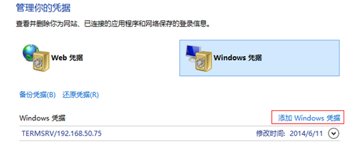

<blockquote class="info">
	打印机常见问题
</blockquote>  
  
 

|  步骤  | 现象   |
| --- | --- |
|1、 |为什么安装hp laserjet M1130_M1210系列和hp pro 400多功能激光一体机打印机驱动时，会虚拟一个光驱，里面是打印机驱动，利用里面的驱动安装会提示安装失败，再次右键更新驱动安装后，重启串行控制器里面显示打印机出现感叹号且打印机为脱机状态？ |
| |  <blockquote class="default">出现该情况是因为hp laserjet M1130_M1210系列和hp pro 400系列多功能激光一体机内置了HP Smart Install 功能，该功能只需要将一体机 USB 连接线连接到电脑，然后开启一体机电源，会自动虚拟一个光驱出来，里面自带打印机驱动。出现安装不成功且安装成功后出现脱机状态，一般情况是该功能导致。 </blockquote> |
| |<blockquote class="success">解决办法：hp laserjet M1130_M1210系列在安装光盘中或官方网站上下载找到→“UTIL文件夹”→“SIUtility”→“Printer”→HP Smart Install Print S00”→“Next”→“Disable HP Smart Install on the selected Printer”→“YES”→“Close” 。重插打印机安装驱动即可。Hp pro 400系列的要在打印机上关闭HP Smart Install 功能。 </blockquote>   |
|2、 |为什么WIN7系统添加共享打印机当时使用正常，但在重启后会显示脱机状态，导致无法打印？ |
| |<blockquote class="default">WIN7系统可能会无法保存共享路径的登录信息，需手动添加共享打印机服务器的登录凭据：</blockquote>   |
| | <blockquote class="success">1.	打开控制面板->用户帐户->凭据管理器->管理windows凭据  2.	手动添加windows凭据   3.	输入共享打印机服务器的机器名、用户名、密码即可：</blockquote>|
| | |
| 3、|为什么打印机打印需要很久，而且这个等待的过程中出现卡机现象 |
| | <blockquote class="success"> 出现这个问题后从以下几个方面入手检查： 1、检查计算机名是否为纯数字，如果是则添加终端前缀名  2、尝试更换打印驱动；</blockquote>|
| | |