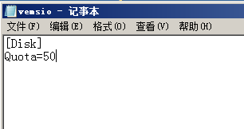

<blockquote class="success">
安装过程常遇到的一些问题问题
</blockquote>  
 

|  步骤  | 问题   |
| --- | --- |
|   1、 |终端启动时提示“DHCP…”但一直无法获取到IP是什么原因？ |
|  | <blockquote class="default">出现这个问题后从以下几个方面入手检查： 1，	检查服务端VEMSServer服务是否启动； 2，	检查此终端是否在管理端终端列表中，如果不在的话检查【允许加入终端】选项是否打开，如果在的话检查是否被禁用； 3，	检查License是否过期 4，	检查终端数是否超过License授权数； 5，	如果在VLAN环境，检查是否对VLAN做调整以允许DHCP广播包通过； 6，	重启VEMSServer服务；
</blockquote> |
|  2、| 终端启动时在DHCP分配IP后提示“TFTP Timeout”是什么原因？ |
|  | <blockquote class="default">出现这个问题后从以下几个方面入手检查： 1，	检查服务端VEMSIO服务是否启动； 2，	检查终端分配的IP与子网掩码是否正确，是否能够与服务端进行通信； 3，	检查终端分配的IP在网络中是否已经存在； 4，	如果在有VLAN的情况下，检查终端分配的IP是否符合当前VLAN的IP规则； 5，	重启VEMSIO服务；
</blockquote> |
| 3、 |为什么终端客户机启动时提示“DHCP…”，需要在出现“DHCP…”阶段暂停十几秒后才能正常获取到IP，有时出现获取DHCP很慢甚至有时获取不到DHCP的情况？|
|  | <blockquote class="default">出现这个问题后从以下几个方面入手检查：   1，检查主交换机上的生成树功能是否关闭；以思科交换机为例：在不需要生成树功能的情况下，进入全局配置模式配置no spanning-tree mode pvst即可； 2，检查客户机网卡和交换机是否兼容，可另接台交换机进行测试或者找到客户机有关PXE更新的ROM进行BIOS升级；
</blockquote> |
|4、  | 为什么开启负载均衡后，主服务器宕机后终端无法获取DHCP地址？ |
|  | <blockquote class="default">出现这个问题后从以下几个方面入手检查： 1、检查备份服务器是否变为主服务器； 2、检查终端是否被均衡； 3、如果在VLAN环境，检查是否对VLAN做调整以允许DHCP广播包通过；
</blockquote> |
| 5、 | 为什么终端编号后，在服务端设置该终端为硬盘启动模式和超级管理员模式，重启后终端在获取IP地址后卡住不动？ |
|  | <blockquote class="default">出现这个问题后从以下几个方面入手检查： 1、检查本地硬盘系统是否可以正常启动，如果不能请确认系统是否正常或尝试修复MBR。 2、请检查服务器是否有虚拟网卡，如果有请在控制台上把终端切换到本地活动网卡IP启动服务器中即可。
</blockquote> |
|  6、|  为什么终端输入编号后按回车确认没有反应又回到编号界面？|
|  | <blockquote class="default">检查此编号的终端是否已存在。</blockquote> |
| 7、 | 安装客户端并重新启动后，右下角客户端标识提示“与服务器断开连接”是什么原因？ |
|  | <blockquote class="default">检查是否在BIOS里设置了网卡为第一启动项。</blockquote> |
| 8、 |  为什么从PXE启动终端时，在XP滚动条过后会一直黑屏|
|  | <blockquote class="default">这种现象一般是系统文件损坏或硬件驱动不正确引起的。如果终端是硬盘启动则重装操作系统再试，如果是网络启动则尝试重新上传镜像。</blockquote> |
|  9、| 为什么从PXE启动终端时，一直停留在XP滚动条处？ |
|  | <blockquote class="default">出现这种问题的原因是终端无法与服务器通信，需要从以下几点入手检查： 	1，如果是新加入的终端，检查服务端网卡PNP中是否有显示该终端网卡驱动，如果没有请更新该终端的网卡PNP驱动； 2，检查网络中是否有其它终端使用了这个IP，这样会产生IP冲突导致终端无法启动； 	3，检查网络中是否存在ARP攻击； 	4，查看是不是镜像文件发送变化，主服务器正在往从服务器同步文件，这个时候网络使用率很高，会造成客户机无法启动或者启动速度很慢。
</blockquote> |
| 10、 | 为什么客户机在获取IP成功出现编号阶段前会卡住不动？ |
|  | <blockquote class="default">在客户机BIOS中检查是否开启了IDE增强模式，如果开启请尝试关闭IDE增强模式。</blockquote> |
|11、  |控制台勾选了允许本地硬盘启动,为什么己经下载过虚拟系统的终端,用了一段时间后重启只有一个本地硬盘启动项?  |
|  | <blockquote class="default">出现该问题一般情况下是因为bios中默认本地硬盘为第一启动项，终端启动时读取本地VBS虚拟系统。出现此问题可能是因为该终端在更新系统或重新下载镜像的时候，用户强制重启了终端。为了保证数据一致，这时终端需重新下载，而这台终端默认加载是设置本地硬盘前的一些服务器配置，当用户强制关机后数据损坏，无法引导加载最新的服务器配置。出现这个问题可直接把该终端设置网络引导为第一启动项，终端会读取最新的配置，进入终端后重新下载即可。</blockquote> |
|12、  |为什么终端启动时提示启动盘MBR不合法？  |
|  | <blockquote class="default">出现该问题是因为当前启动盘是不可引导的，可从以下几个方面入手检查： 1、如当前网络引导则虚拟盘尚未上传，请按流程设置硬盘启动模式进行上传； 2、如当前为本地硬盘引导则是本地硬盘无系统，检查本地硬盘系统是否损坏，可通过PE尝试修复MBR。
</blockquote> |
|13、  |为什么启动虚拟终端系统时提示：“弹出重启不还原：磁盘空间不足。”?  |
|  | <blockquote class="default">请检查选择保存镜像的分区大小或设置数据镜像缓存区大小，是否大于系统镜像大小的2倍且多1G，如果小于请设置大于系统镜像大小的2倍且多1G。</blockquote> |
|  14、|为什么有硬盘的终端，启动虚拟系统时提示：“剩余空间不足，申请磁盘空间失败提示。”?  |
|  | <blockquote class="default">请检查选择保存镜像的分区大小或设置数据镜像缓存区大小，是否大于系统镜像大小。</blockquote> |
| 15、 |为什么无硬盘模式启动己上传的虚拟终端系统，提示:” 剩余空间不足，申请磁盘空间失败提示”？  |
|  | <blockquote class="default">请检查终端是否有插入U盘，如果有请拔除即可。</blockquote> |
|  16、|为什么终端在获取IP地址后，提示IO错误消息：“There is not enough space on the 	disk [XX盘]”？  |
|  | <blockquote class="default">检查服务端镜像、还原点、回写所在的分区大小可使用空间是否大于50G。解决办法：增加服务器硬盘空间或者打开服务端server安装目录下的vemsio.ini，修改里面的大小，默认为50G.如图所示；</blockquote> |
|  | <blockquote class="info">建议服务器镜像、还原点、回写所在的分区大小应大于50G以上，保证后期可扩展性。 </blockquote>  | 
| 17、 |  为什么终端网络启动时选择缓存分区后提示错误：“申请磁盘空间错误”？|
|  | <blockquote class="default">请检查选择的缓存分区大小是否大于镜像大小。</blockquote> |
|  18、| 为什么终端在设置PXE启动后，正常获取IP进入编号界面，输入编号后，界面直接卡住没有弹出选择缓存分区界面？ |
|  | <blockquote class="default">请检查服务器是否有虚拟网卡，如果有请在控制台上把终端切换到本地活动网卡IP启动服务器中即可。</blockquote> |
| 19、 |为什么WIN7客户端，普通用户网络引导硬盘启动后卡在获取完IP之后的页面？  |
|  | <blockquote class="default">请检查激活WIN7的工具是否采用的是RemoveWAT ，如果不是请重新用此工具激活，其它有些激活工具可能存在和我们冲突。 </blockquote> |
| 20、 |  为什么己选择缓存分区的终端，启动后又提示选择缓存分区且只显示一个分区？|
|  | <blockquote class="default"> 请检查终端是终端是否有插入U盘，如果有请拔除即可。</blockquote> |
|  | |