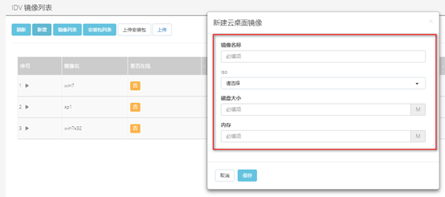
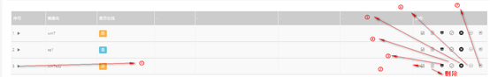
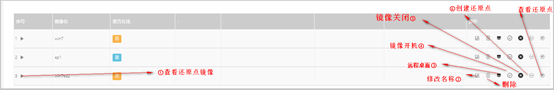
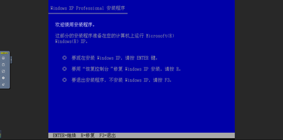

<blockquote class="success">
1、系统镜像制作
</blockquote> 

> 填写镜像名称，选择ISO安装包，填写磁盘大小，填写idv镜像大小（为当前镜像可使用打磁盘大小）
> 

<blockquote class="success">
2、镜像操作
</blockquote> 

<blockquote class="success">
2.1、远程桌面
</blockquote>

