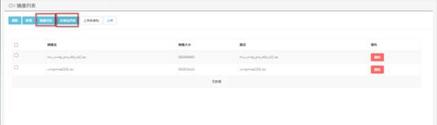
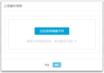
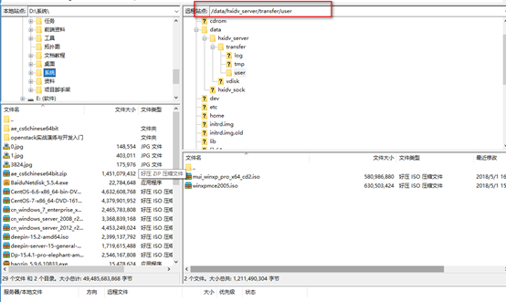

<blockquote class="success">
1、安装包镜像上传 
</blockquote> 

> 管理端—>IDV管理中心->镜像管理
> 
> 
> 点击安装包列表或者镜像列表切换显示对应列表，点击上传安装包，
> 
<blockquote class="warning">
 系统目前仅支持windows 32位操作系统 
 多次上传失败，可采用FTP,SFTP上传镜像文件到/data/hxidv_server/transfer/user 中，上传后请修改文件权限777，点击页面刷新安装包列表即可刷新列表
</blockquote>

 
