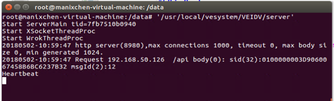
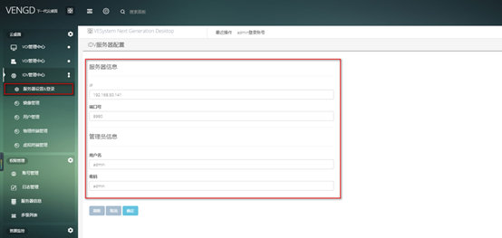

<blockquote class="warning">
	在终端执行 "/usr/local/vesystem/VEIDV/server" 即可开启服务
</blockquote> 

<blockquote class="success">
1、默认端口8980 ，内置管理员  admin  admin 
</blockquote> 

 
<blockquote class="success">
2、服务器设置 
</blockquote> 

> 管理端—>IDV管理中心->服务器设置
> 在管理端配置服务器信息，一次配置后期将会自动登录，后期服务器正常无需重新配置
> 
