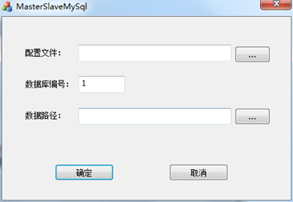
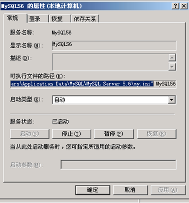
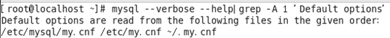
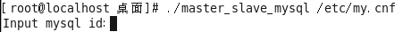

<blockquote class="info">
   VENGD 数据库热备功能配置
</blockquote>

> 数据库热备功能是为了实现系统连接的数据库服务器出现异常或宕机的情况下，系统服务会自动连接到热备数据库服务器，不会对系统使用造成影响。
> 如果要使用数据库热备功能，请在部署系统服务端环境前，先做数据库服务器做如下操作： 
> Windows系统数据库热备配置方式
> 将安装包中的MasterSlaveMySql.exe程序拷贝到数据库服务器上运行，如下图：
 

<blockquote class="success">
  其中配置文件为mysql配置文件路径，可以在系统服务管理端找到mysql服务，右键属性中查看到配置文件my.ini路径，如下图：
</blockquote>

<blockquote class="warning">
数据库编号为对该数据库的标识，建议填写数据库服务器IP最后一位方便记忆。
数据路径为保存数据库变更后差异数据的存放路径，选择数据库服务器上能正常读写且容量足够大的盘符或文件夹目录即可。
</blockquote> 

* * * * *

   
<blockquote class="info">
Linux系统数据库热备配置方式
</blockquote>

> 将安装包中master_slave_mysql工具拷贝到linux系统任一目录，终端中指向该目录，给该程序赋予写权限， 然后运行命令执行该程序，命令如下：./ master_slave_mysql mysql配置文件my.cnf完整路径。 例如系统mysql配置文件my.cnf在etc目录下，则命令如下：
> ./ master_slave_mysql mysql my.cnf。mysql配置文件路径可以通过命令mysql --verbose --help|grep -A 1 'Default options'查看：如下图

输入master_slave_mysql工具执行命令后如下图：

<blockquote class="warning">
这里的id是用来标识数据库服务器的，建议输入数据库服务器ip最后一位，便于后续管理。
输入id后回车，即完成linux数据库服务器配置。
</blockquote>

> 主从数据库服务器都要使用该工具完成此配置操作，该配置操作完成后即可开始进行服务端安装程序的安装流程。在部署服务端时，主从服务器安装时请输入不同数据库服务器的真实IP，主服务器连接的数据库服务器即为主数据库服务器，对该数据库服务器所做的数据变更都将同步到其它从数据库服务器上，并且在主数据库服务器出现异常或者宕机的情况下，系统服务都将自动连接到从数据库服务器。

<blockquote class="danger">
注：数据库配置工具的操作必须在部署和信系统服务端之前完成，因为只有完成了配置之后的变更数据，主数据库服务器才会同步到其它数据库服务器上。如果是从老版本单数据库环境升级到最新版本并且要使用该数据库热备功能，请先将之前数据库上的数据备份，然后运行该数据库配置工具，从数据库服务器在将备份的数据库导入后也要运行该配置工具。

</blockquote>