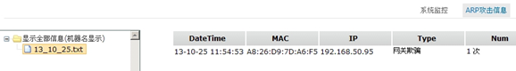

1.ARP攻击信息
<blockquote class="success">
 资源监控中[ARP攻击信息]选项卡可以查看当前网络环境中内网ARP攻击信息，如图；
</blockquote> 

> 若需要得到内网ARP攻击信息，需在ARP策略中开启ARP攻击信息反馈，并设置反馈信息间隔时间与反馈信息组数，方可在ARP攻击信息选项卡中显示攻击信息；
> 若在当前内网环境受到ARP攻击，系统会在设置时间间隔内对用户进行提示，可以通过右下角弹出的提示框进行查看；
 