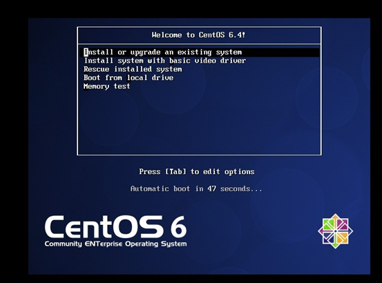
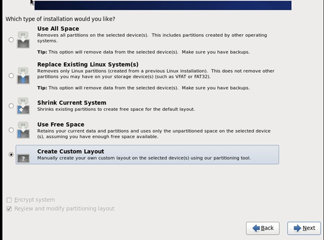
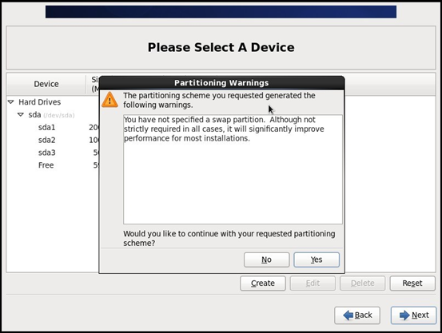
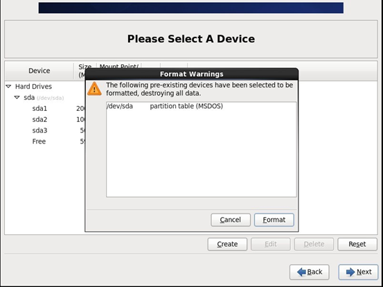
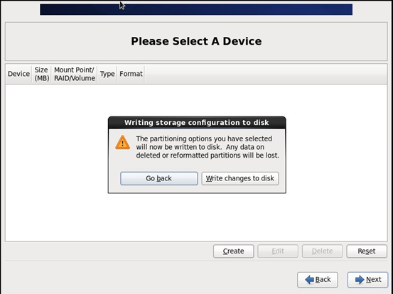
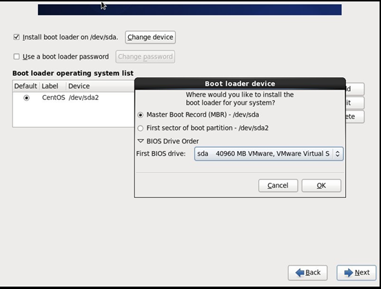
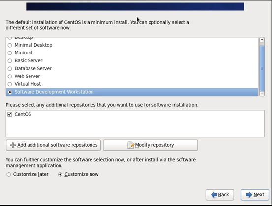
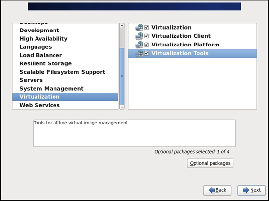
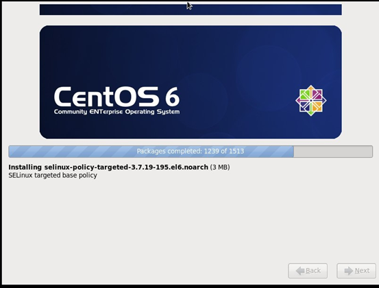

 <blockquote class="success">
	服务器系统安装，建议centos7
</blockquote>  
 <blockquote class="danger">
	 BIOS开启机器硬件虚拟化，不建议虚拟机安装
</blockquote>  

 |序号|事项|
|---|---|
|1、 |使用光盘、U盘等介质进入安装系统界面 |
|2、 | 安装界面选择Install or upgrade an existing system；|
| | |
|3、 |Disc Found界面选择Skip； |
|4、 |语言选择，根据需求即可 |
| | |
|5、 |软件选择:选择：开发及生成工作站，虚拟化Hypervisor|
|| <blockquote class="info">此处附加选项：虚拟化Hypervisor必选，基本环节可根据需求选择</blockquote> |
| |  |
|||
|6、|选择安装位置|
|||
|||
|7、 |网络主机配置 (可选)|
|||
|||
|||
|||
|||
||<blockquote class="warning">等待安装完成即可</blockquote>|
||| 

 
 
 
 <blockquote class="success">
	服务器系统安装， centos6.6
</blockquote>  

1.1   服务器系统安装
服务器操作系统为Centos 6.4 64位，请安装之前开启硬件虚拟化功能，系统安装步骤如下：
1.	使用光盘、U盘等介质进入安装系统界面
2.	安装界面选择Install or upgrade an existing system；

3.	Disc Found界面选择Skip；
4.	语言选择English（English）-U.S. English；
5.	下一安装界面选择Basic Storage Devices；
6.	设置主机名；
7.	选择时区；
8.	设置root用户密码（密码请牢记）；
9.	选择Create Custom Layout；

10.	创建分区：根据实际需要创建根目录（/）、和数据存放分区（/data）；
11.	分区阶段会有警告提示Partitioning Warnings 选择 Yes；

12.	格式化阶段也会有警告提示Format Warnings 选择 Format；

13.	Writing storage configuration to disk 选择 Write changes to disk；

14.	Change device 选择 Master Boot Record(MBR) - /dev/sda；

15.	系统类型界面选择Software Development Workstation和Customize now；
	 
 16.	在组件界面中请务必勾选Virtualization Management 中的Virtualization Tools；

17.	安装过程完成并重启；

18.	重新进入系统完成初始配置；
19.	设置时间后，重启系统使用root登陆系统；
至此，所需系统环境安装完毕，下面开始介绍虚拟服务器环境部署；

