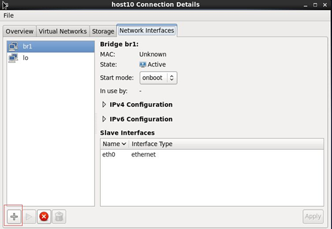
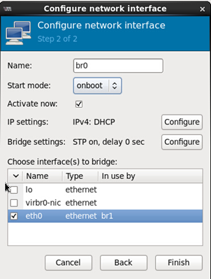
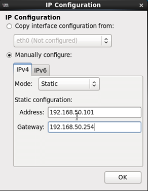
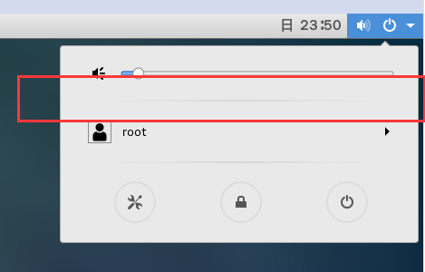

> 1.	将install_vdi_srv.sh脚本程序拷贝到系统中，如果是centos7系统请使用最新的 vdi.tar.gz脚本 安装;
> 2.	定位到脚本目录，并设置权限chmod a+x install_vdi_srv.sh;
> 3.	./install_vdi_srv.sh运行脚本；
> 4.	重新启动系统，并以root账户登录
> 5.	在Terminal界面输入virt-manager，回车。在弹出窗口中，双击localhost；
> 6.	展开Network Interface，窗口左下角点击 +（添加）

（1）Interface Type这项中选择“Bridge”，然后点击右下角 Forward项；
（2）在Configure Network Interface窗口中， Name中填入连接名称 ； Start mode中选择onboot，勾选Activate now；接下来在 Choose interfaces（s）to bridge下勾选物理网卡eth0（多网卡时，请按实际情况选择）；点击IP settings这一栏的Configure选项

（3）在弹出界面中配置固定的IPV4地址，配置好之后选择 OK按钮保存配置；

（4） 安装完成如出现网络消失，如图:

尝试在命令行输入:NetworkManager即可

 <blockquote class="warning">
注：配置完成后，如果可以ping通设置的ip，而以前服务器的ip不能正常ping通，则说明配置已成功，如果服务器系统是使用的centos7以上版本，请使用最新的脚本 vdi.tar.gz安装
</blockquote>   