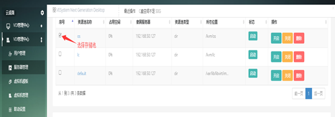

<blockquote class="info">
	关于VDI虚拟机模板
</blockquote> 
 
> 虚拟机模板用于快速创建虚拟机，基于模板创建的虚拟机基础配置基本相同，可定制硬盘，可节约时间，相同类型、配置虚拟机创建一个模板即可
> 

制作新建虚拟机的模板，需将安装虚拟机系统所用的系统iso文件和虚拟机的驱动iso文件vdi_driver.iso先拷贝到虚拟服务器相应的存储池目录下（可使用共享的方式或者第三方工具【如WinSCP、FileZilla将文件拷贝到虚拟服务器上），

> 1.选择存储池，
> 2.在存储池中新建一个虚拟盘作为虚拟机的硬盘（创建时选择qcow2），然后开始模板制作；
> 

<blockquote class="success">
1、实际需要输入和选择虚拟机模板的各项参数，如下图所示： 
</blockquote> 

|注意事项|描叙|
|---|---|
|1、 创建虚拟机模版|所有项必选必填|
|2、硬盘光驱顺序|<blockquote class="success"> 1)必须为IDE光驱->即“系统镜像iso"，如win7x64.iso, 2)必须为VDI_driver驱动文件（安装完成需要使用，避免USB以及分辨率不好使用) 3)选择一块IDE格式的虚拟硬盘，大小根据实际需求选择，确保模板能够正常安装</blockquote>  |
| |<blockquote class="warning"> 请严格遵守步骤!谢谢配合</blockquote>|
|3、网络类型选择|请选择桥接模式，桥接方式请查看VDI虚拟服务器部署|
|4、启动模式|如果您不了解请选择光盘启动|
|5、 || 

  
<blockquote class="success">
2、下一步后点击启动，开启虚拟机： 
</blockquote> 

  
<blockquote class="success">
3、开启远程桌面(前提：先安装VDI远程工具:VOI管理中心->远程工具
</blockquote> 

浏览器将弹出 

点击打开即可弹出远程桌面进行安装操作系统

<blockquote class="success">
4、安装完成系统请手动安装驱动文件（解决鼠标键盘录入不灵敏以及分辨率无法调整问题)，按照页面文字提示，等虚拟机启动安装完成并安装完驱动后（驱动是使用虚拟机系统中光盘加载的系统安装程序安装），
</blockquote> 

<blockquote class="success">
5、关闭虚拟机，点击下一步，系统会自动将先前模板加载的系统iso和驱动iso文件的配置删除，删除完成后，虚拟机模板的制作完成：
</blockquote> 

> 注：1.制作完成的虚拟机模板，可在模板列表的下拉菜单中选择修改来完成模板里面的参数改动；2.如果需要使用VDI扩展功能，需要将客户端程序加入到模板系统的自启动中，详见第三章虚拟机扩展功能部署及配置中第一节；3. 使用虚拟机远程功能需要先完成虚拟机远程工具的安装。

 
  
<blockquote class="warning">
注意：如已安装远程工具VEViewer还是无法打开，请直接复制地址栏地址到IE浏览器中打开即可，如下图：
</blockquote> 

  
<blockquote class="info">
检查工具是否安装：提供两种方式，，如下
</blockquote> 

保远程程序VEViewer已经安装，控制面板中->卸载或更改程序中有：和信桌面虚拟化客户端

开始菜单搜索和信桌面会出现：
