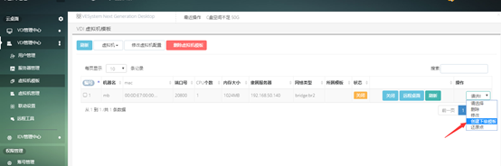
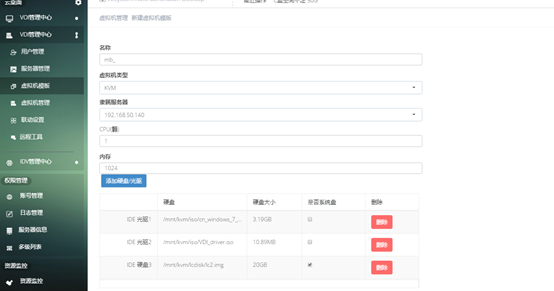
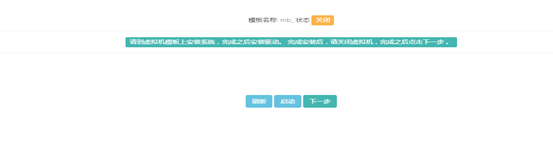
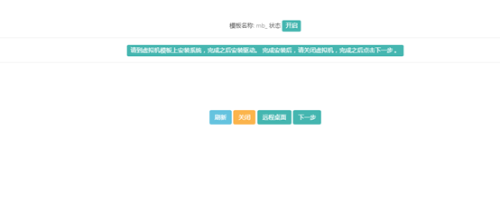

<blockquote class="info">
	关于VDI虚拟机模板更新
</blockquote> 
 
> 如果需要更新已创建模板中的数据，需要创建下级模板来完成，对于模板的数据更新全部存储在下级模板中，不会对之前套用模板创建的虚拟机数据造成影响，具体操作如下：

> 1.	在管理端模板管理右侧下拉选项中，选择【创建下级模板】，如下图：

> 2.在打开的界面中完成模板相关参数的修改，然后点击下一步，如下图：
> 
 
>3、在打开的界面中选择启动，启动模板虚拟机，如下图：
>

>4、在打开的界面中选择启动，启动模板虚拟机，点击远程桌面，远程到虚拟机后，完成对模板数据的修改，再点击下一步，
>

>5、然后点击完成，完成整个模板修改的流程，如下图：
>