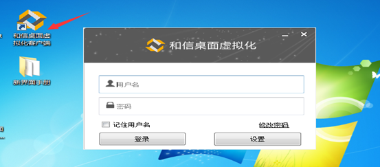

<blockquote class="info">
	关于VDI远程工具
</blockquote> 

> 实现从web服务端远程到服务器虚拟机进行操作，点击VDI管理中心-远程工具，浏览器会自动下载一个远程工具安装包VEViewer.exe，运行后安装远程工具可现实web管理端对虚拟机的远程操作；
> 

 
<blockquote class="success">
远程工具使用
</blockquote>

> 安装完远程工具后双击桌面快捷方式
> 

设置web管理端服务ip，默认端口443

然后输入虚拟机用户名与密码，即可远程控制虚拟机。

登录成功界面如下：
