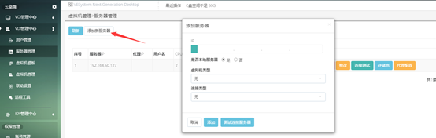
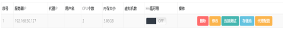
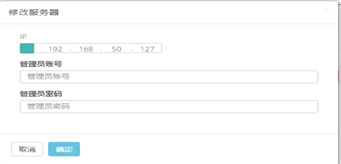
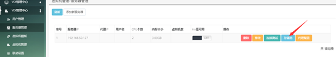

<blockquote class="info">
	关于VDI服务器（点击VDI管理中心-服务器管理）
</blockquote> 
 
> 此处的VDI服务器为先前执行过install_vdi_srv.sh或者 vdi.tar.gz脚本的centos服务器
> 

 

|操作|操作|
|---|---|
|1、新建虚拟服务器 |点击左上角添加新服务器按钮，打开添加服务器设置界面：|
|||
||<blockquote class="warning">在界面中配置服务器相应的信息，点击开通完成虚拟服务器添加</blockquote>|
|2、连接虚拟服务器|添加完虚拟服务器后，在服务器列表操作栏菜单中，选择连接测试，测试与虚拟服务器连接是否正常，连接正常即可进行以下操作；|
|||
|3、修改服务器|可以对已配置的虚拟服务器进行管理员账号和密码的修改|
|||
|4、存储池|用来存放系统ISO以及创建的虚拟机镜像文件等，点击虚拟服务器右侧的下拉菜单，选择存储池，打开存储池界面|  
||<blockquote class="success">具体操作见：存储池&虚拟硬盘管理</blockquote>|
|||
|||