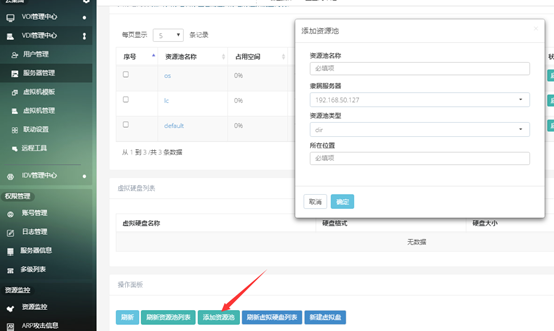
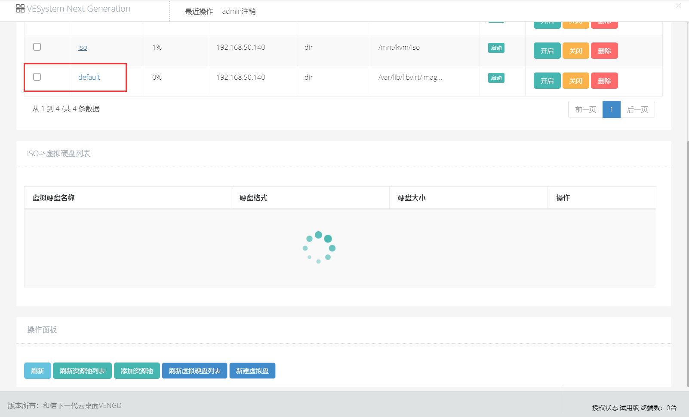
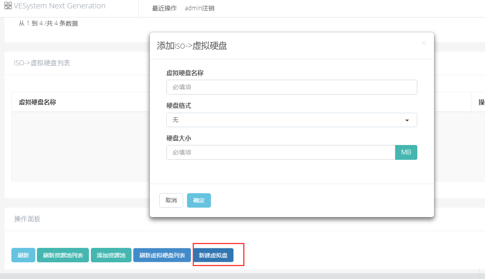

|操作|操作|
|---|---|
|1|添加存储池|
|||
||<blockquote class="warning">输入自定义存储池名称，隶属服务器IP，本地服务器选择资源池类型位dir，最后输入存储池存放虚拟服务器的真实路径，点击保存，完成存储池的添加</blockquote>|
|2、切换存储池->显示虚拟硬盘|点击复选框或者点击存储池名称切换存储池显示对应虚拟硬盘|
|||
|3、添加虚拟盘|选择存储池后 点击新建虚拟盘创建虚拟盘|
||<blockquote class="warning"> 存储池中可以有多个虚拟盘，建议不同功能模块添加一个存储池，创建存储池尽量先在系统创建指定目录，通常因为权限原因可能会创建失败</blockquote>|
|||
||<blockquote class="warning">此处虚拟硬盘可理解为安装系统的硬盘，后期安装虚拟机需要选择的硬盘，大小根据实际需要选择，可在创建虚拟机模板时根据需求创建</blockquote>|
|||
|||
|||
|||