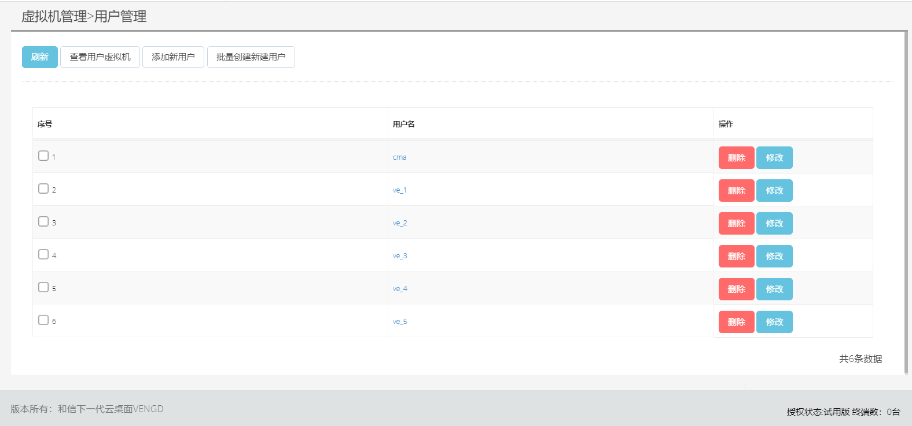

<blockquote class="info">
	关于VDI用户管理
</blockquote> 
 
>用户指的是虚拟机使用者，点击用户名称可以在右侧看到该用户下的所有可使用的虚拟机，点击虚拟机管理-用户管理，打开用户管理界面：
> 

|操作|操作|
|---|---|
|1、创建用户 |点击界面菜单用户管理-右边界面点击添加新用户，打开用户创建界面，按实际情况输入相应信息，保存完成用户添加；|
| | |
|2、批量创建用户| 点击批量创建用户即可，填写用户前缀和用户数
| | |
| | |
| | |
| | |