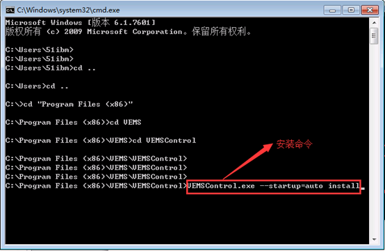
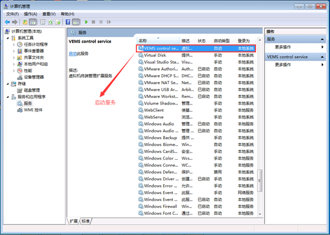

> 虚拟机扩展功能服务需要和web管理端安装在同一个服务器上，故分为windows版本和linux版本2种安装方式，下面会详细介绍安装流程:
> 
<blockquote class="success">
1. windows平台服务端部署
</blockquote> 

|操作|操作|
|---|---|
|1|首先将VEMSControl软件包复制到C:\Program Files (x86)\VENGD\目录下，然后cd 到VEMSControl目录下执行图-1的安装命令和启动命令，在图-2中就可以看到安装完成运行的服务|
|图1)||
|图2）||
|2||
|1||

  
<blockquote class="success">
2. Linux平台服务端部署
</blockquote> 

|操作|操作|
|---|---|
|1、安装Python|可连接源在线安装，也可以使用提供的软件包中已下载好的软件包安装，安装步骤如下|
||<blockquote class="success"> wget http://www.python.org/ftp/python/2.6.6/Python-2.6.6.tar.bz2 2. tar xvjf Python-2.6.6.tar.bz2 3. cd Python-2.6.6 4. ./configure 5. make 6. make install</blockquote><blockquote class="warning"> 注：Centos系统自带Python2.6，其它linux系统也可以在安装Python前，检查一下Python是否已安装，已安装的话可以跳过此步骤！</blockquote>|
|2、安装pip|同样可连接源在线安装，也可以使用提供的软件包中已下载好的软件包安装，安装步骤如下：|
||<blockquote class="success"> 1. wget --no-check-certificate https://github.com/pypa/pip/archive/1.5.5.tar.gz 2. tar zvxf 1.5.5.tar.gz    3. cd pip-1.5.5/ 4. python setup.py install</blockquote>|
|3、安装Python第三方包|安装Python第三方包同样可以连接源在线安装，也可以使用提供的软件包中已下载好的软件包安装，安装步骤如下| 
||1.	pip install tornado 2.	pip install torndb 3.	pip install paramiko 4.	pip install ecdsa|
|4、安装虚拟机扩展功能服务端|将vems-control-1.0-1.x86_64.rpm文件拷贝到linux服务器上，运行以下命令进行安装： rpm -ivh VENGD-control-1.0-1.x86_64.rpm 安装完成后，系统会加入一个自启动的vems-control服务 |
||<blockquote class="warning">注：使用已下载好的扩展包部署，只需要将要安装的扩展包解压，指向解压缩目录，然后运行python setup.py build和python setup.py install命令即可</blockquote>|
||| 

  
<blockquote class="success">
3.	虚拟机扩展功能客户端程序部署方式
</blockquote> 

> 需要在制作系统模板的时候将扩展功能客户端程序modify_network.exe，添加到系统的自启动中即可。