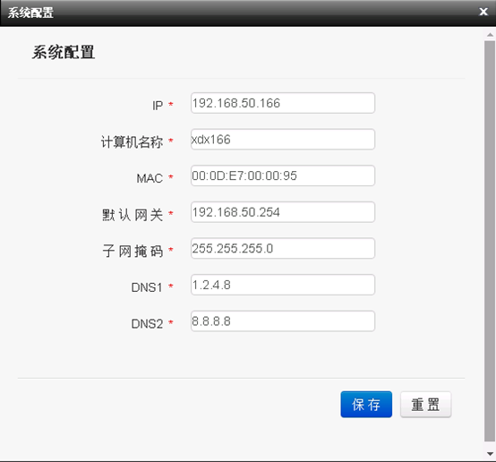
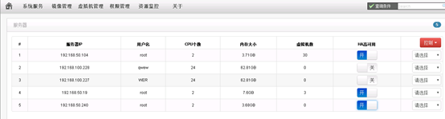

> 服务端以及客户端的扩展功能部署完成后，即可点击虚拟机列表右侧的下拉菜单，选择系统设置，可以设置虚拟机的IP信息、MAC地址以及机器名，设置完成后，虚拟机启动后自动根据设置的系统信息，对虚拟机做相应修改，如下图：
> 

|操作|操作|
|---|---|
|使用条件|服务端扩展功能部署完成，添加2台或以上的虚拟机服务器，所有虚拟机服务器存储池使用同一个共享存储服务器的共享目录|
|使用方法|满足上述所有条件后，在管理端虚拟机服务器管理界面，将需要使用HA高可能功能的服务器设置为开启状态即可，如下图|
|||
||| 

<blockquote class="success">
> 开启了高可用功能的服务器，在网络出现异常无法正常连接或者宕机的情况下，系统会自动将该服务器上的所有虚拟机配置信息同步到其它开启了高可用的服务器上，故障服务器上正在使用中虚拟机不会造成任何影响，重启后即可在同步的服务器上看到该虚拟机正常的状态信息，关闭状态的虚拟机再开机会自动读取同步服务器上的配置信息启动，在同步服务器上也可看到该虚拟机的正常状态信息。
</blockquote> 
