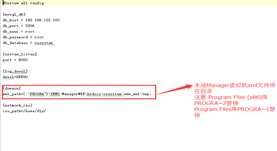

<blockquote class="info">
	虚拟机扩展功能配置
</blockquote> 

>服务端部署完成后，需要手动修改服务所需要使用到得配置文件，配置文件为Control\config目录下的vems.conf

<blockquote class="warning">
 注意
</blockquote> 

> 其中[mysql_db]中需要正确填写数据库服务器的ip、端口、用户名和密码信息，[domain]中需要填写web管理端存放虚拟机xml文件的目录。
> linux系统下的目录路径：/var/www/html/vesystem/vmm_xml/tmp
> windows系统下则为安装管理端时所选择的目录\htdocs\vesystem\vmm_xml\tmp\
> 完成配置修改后，重启vems-control服务；
