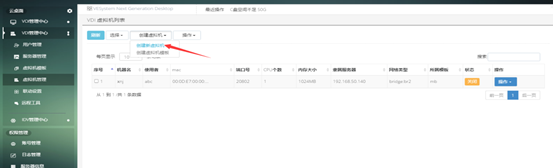
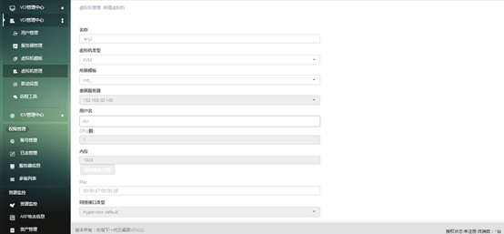
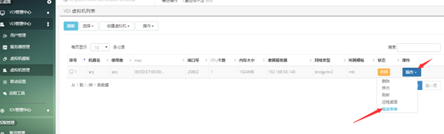
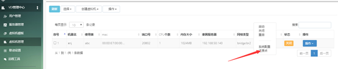
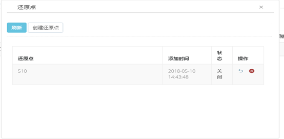
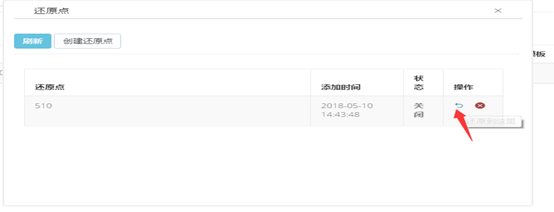
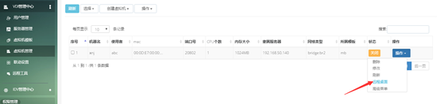

<blockquote class="info">
	关于VDI虚拟机
</blockquote> 
 
>虚拟机与用户可以是多对一的关系，一个用户可以有多个虚拟机
>

<blockquote class="success">
1、 虚拟机创建
</blockquote>

> 点击虚拟机管理-虚拟机列表打开虚拟机界面，点击右上角的创建虚拟机，打开虚拟机新建页面，根据实际情况选择相应的参数，完成虚拟机新建操作：
> 
> 
> 
<blockquote class="info"> 
其中模板可以选择先前制作完成的模板参数，也可以手动自己设置相应参数，所属用户可以多选也可单选。
</blockquote>

  
<blockquote class="success">
2、 恢复还原点
</blockquote>

> 点击虚拟机列表右侧的操作下拉菜单—高级菜单，选择还原点
> 

> 在打开的界面中输入还原点名称以及描述，保存还原点：
> 
> 
> 还原点保存的是当前虚拟机的状态，当需要恢复还原点时点击还原点右侧还原图标，完成还原操作：

  
<blockquote class="success"> 
3、虚拟机远程
</blockquote>

> 点击虚拟机列表右侧的远程图标，可远程到虚拟机上操作：
> 
> 
注：使用虚拟机远程功能需要先完成虚拟机远程工具的安装。