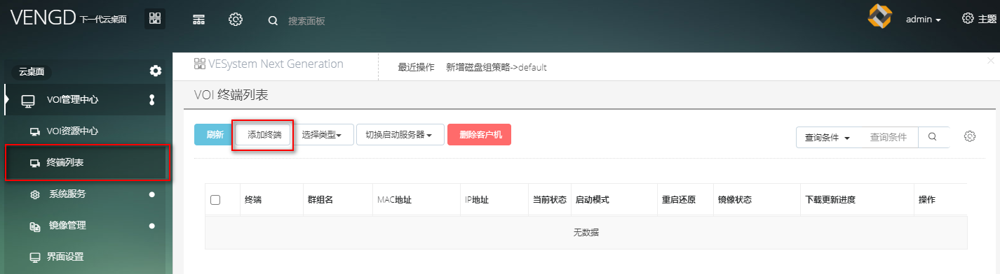
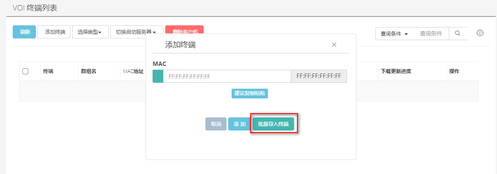
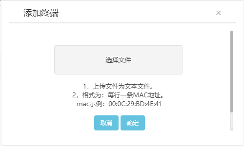
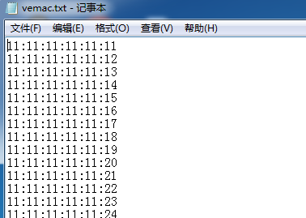

<blockquote class="info">
	  此章节适合手动添加终端
</blockquote> 

| 步骤  |   操作 |
| --- | --- |
| 1、单个添加 | VOI管理中心->终端列表->点击``添加终端``即可 |
|  |  |
|  2、批量添加|  VOI管理中心->终端列表->点击`添加终端`在模态框选择`批量导入终端`|
|  |  |
|| <blockquote class="warning"> 注意:批量终端格式</blockquote>|
|||