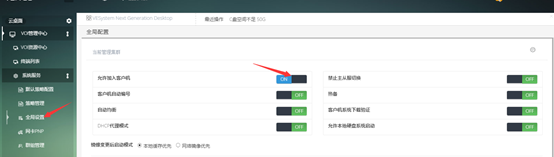
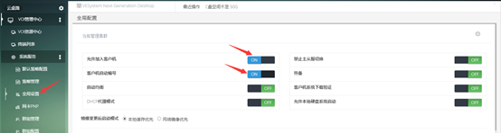

<blockquote class="info">
	  此章节适合自动添加终端,4种方式
</blockquote> 

<blockquote class="success">
	 1）在客户机输入编号添加，本方法的前提条件为：
</blockquote> 
 
1. 在系统服务的全局配置中勾选[允许加入客户机]即可，如下图

2.终端设置为PXE启动模式，PXE启动。
满足以上条件后，客户机启动会进入到编号界面，按实施规划输入编号即可完成添加过程， 如下图；编号完毕后在管理端刷新即可看到新加入的终端，
 

* * * * *
  
<blockquote class="success">
	 2）全自动添加，本方法的前提条件为：
</blockquote> 
1. 在全局策略的终端设置中设置勾选[允许加入客户机]且已打开[客户机自动编号]，如下图

2. 终端设置为PXE启动网络引导模式；
3. 满足以上条件的终端在启动时会自动添加到控制台列表中；

  
<blockquote class="success">
	3））终端编号模式，本方法的前提条件为：
</blockquote> 

> 终端编号模式分为编号生成IP模式以及编号与IP无关模式两种。
> 编号生成IP模式：是指客户端在编号界面输入的编号就是分配给客户机的IP地址；
> 编号与IP无关模式：是指客户端在编号界面输入的编号与系统分配给客户机的IP没有关系，系统会自动从地址池查找没有使用的IP分配给当前客户机；

  
<blockquote class="success">
	4））默认DHCP分配，本方法的前提条件为：
</blockquote> 

> 可以根据选择的不同网络策略下发DHCP，客户机启动后就可以编号加入到相应的网络策略中。
> 

  