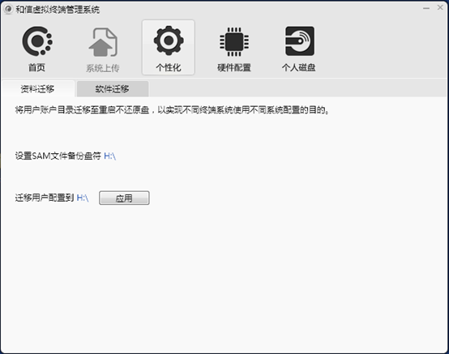
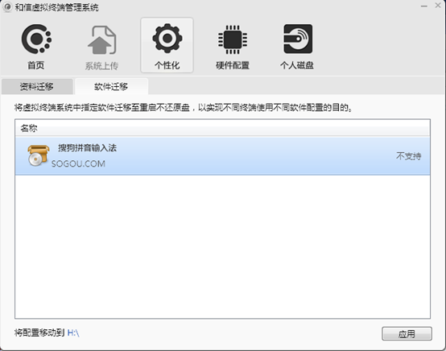

<blockquote class="success">
	关于SAM文件
</blockquote>  

> SAM文件是用于保存windows SAM文件，而windows SAM文件用于保存windows账户信息的文件；

 
1.   什么是用户配置

>    用户配置是将windows系统C盘Documents and Settings 文件夹中的当前存在账户文件迁移到指定盘符，指定的盘符可以是虚拟磁盘和本地磁盘，用于保存个人资料等信息；

2.  如何迁移SAM文件与用户配置

> 终端以超管用户网络启动后，点击右下角程序托盘图标，在个性化中选择备份盘符以及迁移盘符，单击[应用]可选择需要迁移以及备份的盘符，完成盘符选择后待迁移完毕退出程序即可；如图示；

3.  软件迁移
<blockquote class="info">
	软件迁移是能够根据当前系统使用需要，将需要保存软件的注册表信息或者配置文件信息迁移到设定好的盘符，以实现软件使用的配置个性化。
</blockquote>
4.  怎么使用软件迁移？

> 使用软件迁移脚本工具生成需要迁移软件的脚本文件，将生成的脚本文件放到下面目录中C:\Program Files\VENGD\Client\backup，这个时候在个性化软件迁移界面中就可以看到该软件，已经存在的软件不需要使用工具再生成脚本，勾选需要迁移的软件，设置迁移盘符点击应用，就可以将脚本中设置好的注册表信息以及配置文件迁移到目标盘符中，普通用户登录系统对软件所做的个性化设置可以保留下来，如下图所示：
