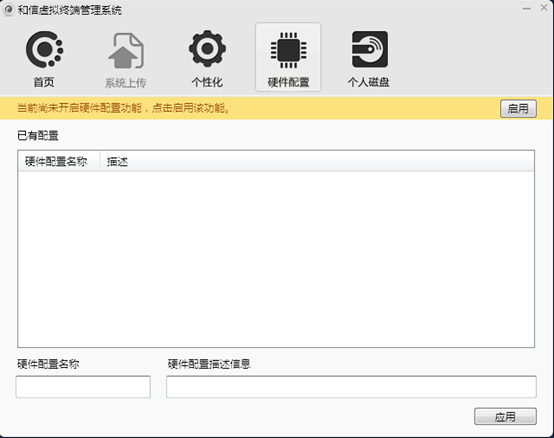

<blockquote class="success">
	关于硬件配置
</blockquote>  

> 硬件配置是

 
1.   什么是多硬件配置支持驱动

> 守护驱动是用于多硬件配置支持的驱动程序，是实现同一镜像中兼容多种差异硬件设备功能的驱动程序

2.   如何安装多硬件配置支持驱动

> 在完成上一章节操作之后，若局域网中存在差异硬件需要兼容则可在此启用多硬件支持即可；如图示；
> 
> 
<blockquote class="warning">
	注：安装多硬件配置支持驱动完毕后，在默认硬件配置的超管下安装服务、驱动等对注册表SYSTEM键值的操作也会在重启后复原。如果在安装多硬件支持驱动后需要对以上地方做出修改的话，可以开启维护模式来实现；
</blockquote>  

3  如何保存硬件配置

> 保存硬件配置需同时满足两个条件：
> 条件一：必须安装多硬件配置支持驱动
> 条件二：所保存客户机必须是超级管理员权限
> 

<blockquote class="info">
满足上述两个条件后在系统托盘处安装点击[保存硬件配置]，定义硬件配置名称，保存成功后管理端控制台硬件配置策略将自动生成与名称对应的策略，关闭终端机器后将客户机拖入策略后即完成硬件配置的部署；
</blockquote>  