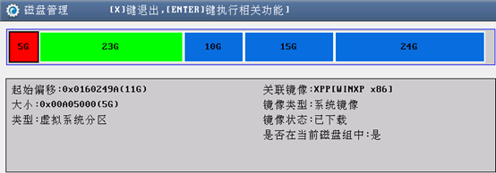
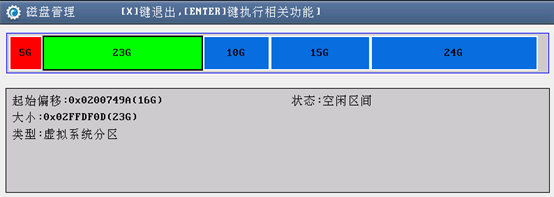
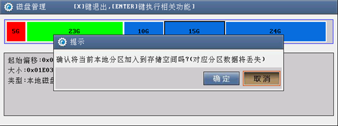
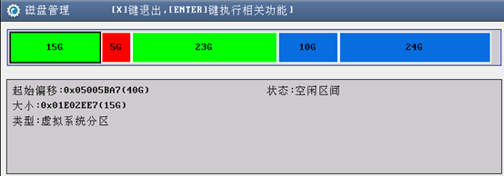

<blockquote class="info">
	系统客户端管理模式
</blockquote>

|步骤|操作|
|--|--|
|1）|镜像下载，用于缓存服务端镜像到本地磁盘上；| 
|2）|存储空间管理，可以看到本地磁盘存储空间使用情况，已选择映射的分区空间不足时可以再映射本地磁盘的其它分区作为缓存分区，如下图：| 
||| 
||| 
|3）|选择本地磁盘上15G的分区新增为存储空间，如下图| 
||| 
|4)  |一键清除所有不还原空间，用于清除客户机重启不还原数据；| 
|5）|一键清除所有虚拟系统，用于清除与服务端所有镜像文件的映射关系，使用后本地需要重新映射；| 
|6）|一键清除所有不在当前磁盘组中的虚拟系统，用于清除与服务端不在当前客户机使用的磁盘组中镜像文件的映射关系，使用后本地如需使用其它磁盘组中的镜像需重新映射；| 