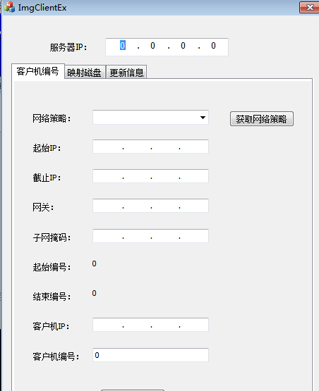

<blockquote class="info">
	系统客户端无DHCP部署模式
</blockquote>

* * * * *
### 什么是无DHCP部署模式
>无DHCP部署模式适用于客户端计算机无法正常获取到服务端DHCP的环境中，只限于非上传客户端使用该模式；
> 
|步骤|操作|
|--|--|
|1）使用无DHCP部署模式|安装客户端时勾选无DHCP部署模式选项，如下图| 
|  || 
||安装过程中会弹出编号以及映射本地磁盘分区的界面，如下图| 
||| 
|||  
||<blockquote class="warning">填写正确的服务器IP，获取相应要编号的网络策略后，输入可用的客户机IP和编号信息，完成编号后，选择本地的映射分区，重启计算机后系统会自动将镜像文件缓存到本地映射分区中。 </blockquote>|