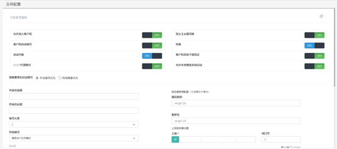

<blockquote class="info">
	什么是全局策略
</blockquote> 
 
> 全局策略是虚拟终端管理系统全局信息配置；

* * * * * 
 
1.  如何配置全局策略
<blockquote class="success">
VOI管理中心->系统服务->全局设置
</blockquote> 

|名称|描叙|
|---|---|
|允许加入客户机 | 允许加入客户机为允许终端客户机加入虚拟终端管理系统，若关闭则管理端中终端列表以外的客户机无法加入|
|客户机自动编号 | 客户机自动编号开启该功能后终端加入系统无需手工输入编号，将全自动添加并自动编号；|
|热备 |热备是当集群中有多个服务器的情况，可以开启热备功能，让服务期间互为热备份关系，某个服务器宕机后，其它热备服务器可以接管宕机服务器上的客户机； |
| 自动均衡|自动均衡是集群中有多个服务器的情况下，系统会根据服务器的负载压力，动态分配客户机到不同服务器，实现负载均衡，请保证至少在两台服务器模式下开启，否则将无法实现负载均衡功能； |
|禁止主从服切换 |禁止主从服切换是防止主服务器意外宕机后，从服务器自动接管成为主服务器，开启此功能后，主服务器宕机，从服务器不会自动接管，必须等待主服务器再次正常运行； |
|DHCP代理模式 |DHCP代理模式是为了配合客户现场已存在并且要使用的DHCP服务器工作的选项，勾选此功能并设置第三方DHCP服务器指向我们的服务器后，客户机到编号界面编号后会自动配合客户现场的第三方DHCP服务器分配终端IP； |
|客户机系统下载验证 |客户机系统下载验证是控制客户机启动后进入系统下载管理界面时是否需要输入密码验证； |
|镜像变更后启动模式 | 镜像变更后启动模式是针对在服务端镜像开超管做了变更后，尚未更新到最新状态的客户机所做的操作，当设置为网络镜像优先模式，客户机会从服务器上最新镜像启动，如果设置为本地缓存优先模式，客户机会从本地硬盘已缓存需更新的镜像启动；|
|终端名前/后缀 |终端名前/后缀是设置客户机编号前/后缀名称，设置完毕后，全局所有客户端的机器名将添加该前/后缀名称； |
|编号位数 | 编号位数是定义客户机编号位数，如定义为2位，则机器名编号最大为两位，最大为99；同之定义为 3位则最大为999 ；|
|允许本地硬盘启动 |允许本地硬盘启动是在激活开启磁盘组选择的情况下可选，允许在网络启动模式下允许用户选择本地硬盘上的系统； |
| 全局还原点路径| 全局还原点路径是用于存放还原点路径，还原点是超级管理员模式下用于记录超级管理员对磁盘镜像操作的记录文件；|
|上级服务器设置 | 上级服务器设置是针对需要使用到上下级集群的环境而做的设置;|
| | |
| | | 