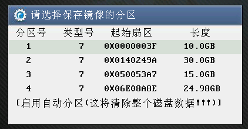
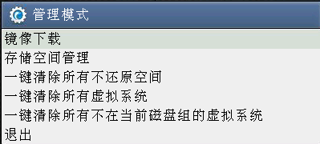
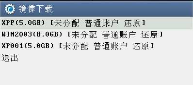

<blockquote class="info">
	系统客户端镜像缓存
</blockquote>

### 什么是镜像缓存
>镜像缓存是指将服务端已经上传好的镜像文件缓存到客户机本地的磁盘中，已缓存过镜像的客户机启动可以选择从本地缓存启动，以减轻服务端压力并且可实现断网可用。
> 
<blockquote class="danger">
注： 建议虚拟操作系统中的安装可在上传系统后在进行安装； 
Linux操作系统下，重启终端后运行Vtools –upload命令上传系统；
</blockquote>

  
### 如何缓存镜像 

|步骤|操作|
|--|--|
|1、客户机编号网络引导启动后会出现选择镜像保存分区的界面，如下图||
||<blockquote class="success">这个时候需要选择本地磁盘一个分区作为镜像缓存分区，选择的分区容量需要比服务端的镜像文件大，最好是服务端镜像文件大小的2倍+1G（设置重启不还原会需要用到此空间）；</blockquote>|
|2、选择缓存分区并提示初始化完成后，可以直接使用已上传的镜像启动，进入系统后再缓存镜像，也可以直接按【Home】键进入管理模式，选择镜像下载，如下图：||
|3、选择镜像下载，进入下载界面||
|4、选择需要下载的镜像文件，开始下载||
|||
|||