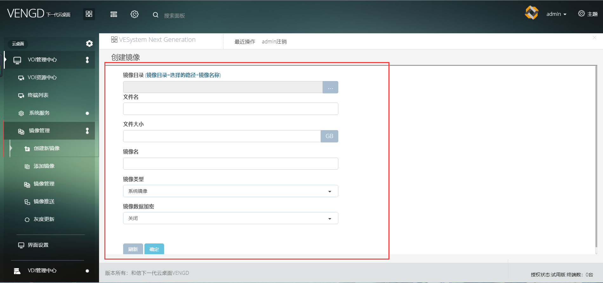
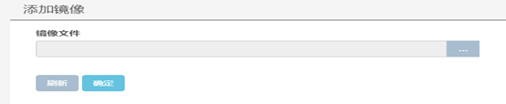
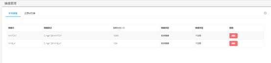
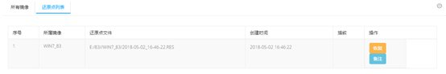

<blockquote class="info">
	什么是镜像管理
</blockquote> 
 
> 镜像管理是用于管理新建虚拟磁盘、新建物理映射盘、添加/删除虚拟磁盘以及创建、恢复与删除还原点功能；

* * * * * 
 
1.如何创建镜像 
<blockquote class="success">
创建镜像为新建虚拟磁盘，如下图：
</blockquote> 

 
2、添加镜像
<blockquote class="success">
可将原创建但未删除的磁盘镜像添加到系统中，如下图：
</blockquote> 

 
3.镜像管理
<blockquote class="success">
镜像管理显示创建的所有镜像，以列表形式显示出来，以便集中管理，如下图：
</blockquote> 

 
4.删除镜像
<blockquote class="success">
删除镜像将在虚拟终端系统删除虚拟磁盘与物理磁盘，但实际中在物理硬盘上的镜像文件与物理硬盘并未删除，需人工手动删除；不建议系统中删除的磁盘立刻在物理硬盘上删除，若删除掉则无法恢复；
</blockquote> 

 
5.恢复还原点
<blockquote class="success">
恢复还原点可将因勿操作引起系统镜像文件损坏或导致虚拟操作系统崩溃通过恢复还原点来进行镜像回滚；重而实现镜像回滚到上次正确的虚拟操作系统中；
提示：还原点为自动创建，每个还原点所保存的数据是每次超管的开启到关闭操作中的数据，该数据保存为差异文件，当恢复还原点时，将差异文件与镜像文件合并，所以每开启一次超管就会产生一个还原点用于保存操作数据；如下图：
</blockquote> 

