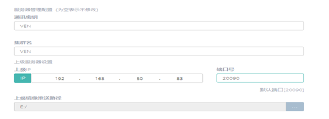
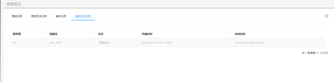
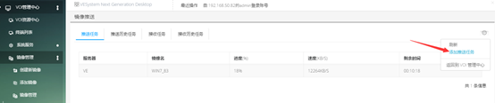
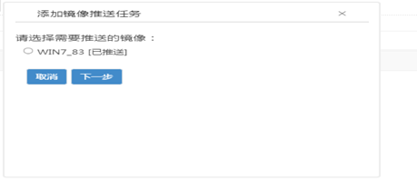
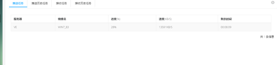
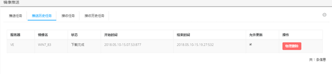
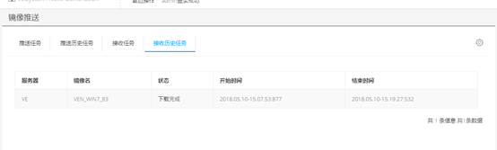

<blockquote class="info">
	什么是镜像推送
</blockquote> 
 
> 镜像推送是在同一系统中的上下级集群间，将上级集群中的镜像推送到下级集群的过程。

* * * * * 
 
1. 配置镜像推送：(VOI管理中心->镜像管理->镜像推送)
<blockquote class="success">
首先在下级集群的全局设置中需要正确配置上级服务器信息以及本级集群保存推送镜像的路径，如下图所示：
</blockquote> 

<blockquote class="warning">
注：在同一局域网中上级服务器的IP为内网IP，端口号默认为20090，在跨广域网的环境中，上级服务器IP与端口号为映射到外网的IP和端口号。
</blockquote> 

> 配置完下级集群后，可在上级集群的镜像推送窗口中选择添加任务，在弹出的窗口中选择需要推送的镜像以及需要推送的下级集群，完成后可在推送任务栏中看到推送的进度，如下图所示：

完成的推送任务会在推送历史任务菜单中看到，并可对已经推送到下级的任务进行删除以及设置为不允许更新操作。其中设置为不允许更新的任务，上级集群镜像更新后就不会到推送更新到下级集群；删除的任务，上级集群就会停止对下级集群进行推送，如下图所示

推送进度显示：

同样的，在下级集群中就可以在接收任务和接收历史任务中看到相关推送情况。

