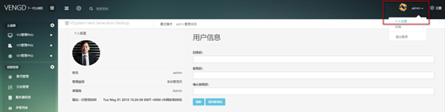
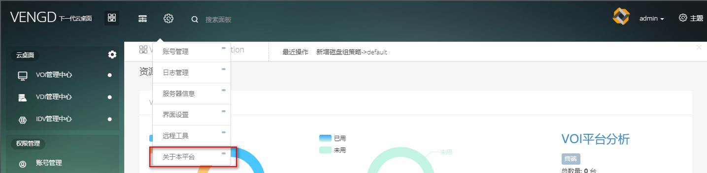
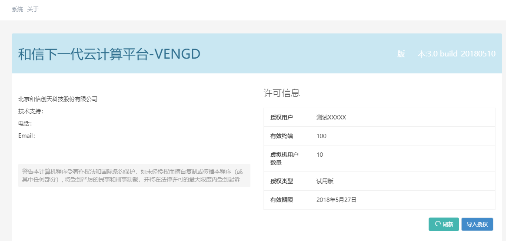

<blockquote class="info">
	 设置管理员密码
</blockquote> 

> 在WEB管理界面，单击[权限管理]、[修改管理员密码]菜单，打开修改密码对话框，并输入旧密码、新密码和确认新密码，点击[确定]；修改成功后系统弹出提示修改密码成功：
> 

<blockquote class="warning">
	注：建议密码长度至少10位，为了您的安全，请使用足够长且复杂度较高的密码；
</blockquote> 

* * * * *
   
<blockquote class="info">
	关于本平台>导入授权证书
</blockquote> 

