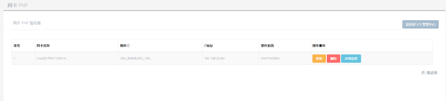
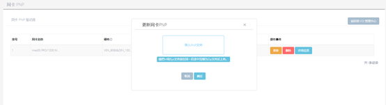

<blockquote class="success">
	 什么是网络PNP
</blockquote> 
 
> 网络PNP是服务端里面集成很多种不同的网卡驱动，当客户机系统上传完后，不同的网卡的客户机不需要像传统方式去做网卡PNP即可网络启动客户机终端系统。

1. 什么是网卡PNP设置
 
> 网卡PNP设置可以让您在服务端完成客户机终端的网卡PNP驱动的更新和终端网卡属性的修改。在服务端上修改的设置将在下次客户机终端重启后生效，且对正在使用的客户机不会造成任何影响。

在WEB管理端上，点击[系统服务]菜单，选择[网卡PNP]即可弹出网卡PNP设置界面，如下图：

网卡PNP驱动列表中显示的为当前已加入和信虚拟系统的终端网卡信息，多台终端使用同一种网卡时只显示一个。
<blockquote class="warning">
提示：当终端通过网络启动后，网卡PNP驱动列表中只显示硬件ID等信息，无法显示网卡驱动名称时，说明当前服务端中没有集成该终端的网卡驱动，请使用[更新]功能来安装此网卡PNP驱动。
</blockquote> 

2. 如何更新网卡PNP驱动

> 更新网卡PNP驱动前，请先从终端配套驱动光盘或网络下载的方式得到网卡驱动安装包并解压，将解压得到的sys和inf文件压缩成ZIP格式放到文本管理端所在计算机上，然后在[网卡PNP]中选择要更新的网卡，点击 刷新，在弹出的打开对话框中选中网卡驱动包的ZIP文件即可更新网卡驱动。

 
* * * * *  
<blockquote class="info">
提示：当您选择正确且硬件ID匹配的网卡INF文件时，程序会提示驱动文件”更新完成”。如果您选择的INF文件不包含这块网卡的信息,程序会提示”解释INF文件失败，可能是由于INF文件的硬件ID不匹配”，当出现这个提示时，请选择匹配的网卡驱动进行更新。
</blockquote> 