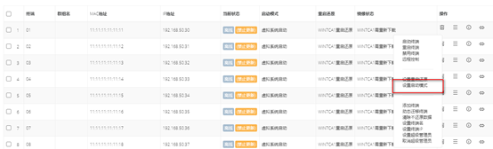

<blockquote class="info">
	VENGD系统客户机安装(Windows)
</blockquote>

<blockquote class="danger">
注：安装前请确认客户机操作系统所在分区格式必须为NTFS格式；
</blockquote>

| 步骤  |   操作 |
| --- | --- |
|1、客户端安装  |  在客户端安装机器上解压VENGD安装压缩包文件，双击VENGDClient_Install.exe文件进行VENGD客户端端安装，开始安装客户端； 选择是否使用无DHCP模式部署（无DHCP部署模式详见VENGD系统客户端安装与部署2.6）， 设置个人磁盘服务端IP地址， 设置完毕后单击[下一步]完成客户端安装并重启机器； <blockquote class="warning">注：无DHCP部署模式适用于不能正常获取服务端DHCP的环境中。</blockquote> |
|  |  |
|2、VENGD Client配置  | 1）在电脑BIOS中设置系统引导顺序改为网络引导，保存BIOS重启机器；如图示意为BIOS中的一种设置界面； |
|  | 2）重启机器以后，将看到客户端发送DHCP并得到回应，回应界面中提示输入客户编号；如图；   |
|  | 3）在Please input client num:  处输入终端编号并回车后选择启动磁盘组，默认为[默认策略]；在次回车后提示未找到网络引导提示：错误的系统版本号0 ! 原因虚拟磁盘为新建磁盘，磁盘中无系统引导数据，需在管理端设置该客户机的启动模式，详见下面的操作步骤；  |
|  |  4）回到web管理端界面中将刚才输入编号的客户端机启动模式修改为[硬盘启动]；修改方式为点击客户机右侧的编辑图标，在弹出的设置菜单中选择硬盘启动模式，如下图     |
|  | 5）切换启动模式完毕后进行超管设置，点击如下图，将需要设置为超管的镜像勾选即可设置超级镜像；    |
|  |  6）设置完毕后启动设置为超管的客户机，进入本地操作系统；  提示：在上述步骤中的第2）步中，输入的客户编号即为终端编号，即终端的机器名与IP地址；在编号范围根据网络策略中的地址池来定义，默认地址池为192.168.x.2--192.168.x.253，代表当前该网段允许编号范围为2—253之间（不含253）；|
|  | 7）客户机启动后会显示选择镜像保存分区的界面，如下图   |
|  | <blockquote class="success">	这个时候需要选择本地磁盘一个分区作为镜像缓存分区，选择的分区容量需要比服务端的镜像文件大，最好是服务端镜像文件大小的2倍+1G（设置重启不还原会需要用到此空间），选择好分区初始化完成后客户机进入本地磁盘上的操作系统，准备开始上传系统镜像步骤。</blockquote> |
|  |  |
|  |  |
|  |  |
* * * * *

<blockquote class="info">
	VENGD系统客户机安装(Linux)
</blockquote>

> 解压安装包后，运行./install.sh，安装客户端程序，安装完成后，重启计算机；
> 

