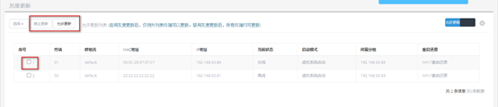

<blockquote class="info">
	什么是灰度更新
</blockquote> 
 
> 灰度更新：是对终端更新镜像的管理，可实现对每台终端是否允许更新镜像进行控制。 

* * * * * 
 
1. 配置灰度更新：(VOI管理中心->镜像管理->灰度更新)
<blockquote class="success"> 
在管理端镜像管理中选择灰度更新，第一次开启该功能后默认所有终端都为禁止更新状态，在右侧的禁止更新列表中，可以勾选允许更新的终端，设置为允许更新，如下图所示：
</blockquote> 

