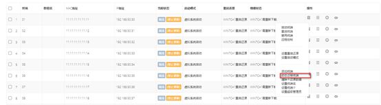
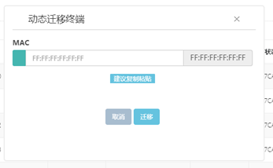

<blockquote class="info">
	  动态迁移终端
</blockquote> 

<blockquote class="success">
	使用前提：
</blockquote> 

> 当客户端计算机因为故障需要更换或者网卡故障需要更换网卡，但是又要客户机使用以前的所有配置就需要使用此功能。
> 使用方法：点击需要更换网卡的客户机选择动态迁移终端，在弹出来的窗口中输入更换后的网卡MAC地址，如下图

> 点击迁移终端后程序会将以前客户机的MAC地址替换成新的，客户机可以照常使用以前的所有配置，无需重新配置。

