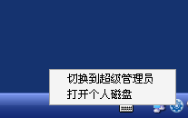
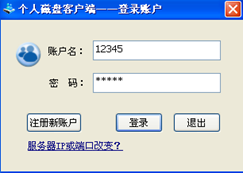
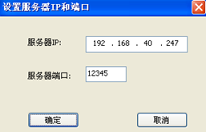

<blockquote class="info">
	关于个人磁盘管理系统
</blockquote>

<blockquote class="success">
	右键客户端选择[打开个人磁盘]即可进行个人磁盘系统注册与登录操作，如图
</blockquote>  

<blockquote class="info">
个人磁盘系统客户端无法与服务端连接，需重新设置服务端IP或端口，在登录窗口下面有提示，如图；
</blockquote>  

