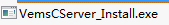
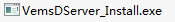
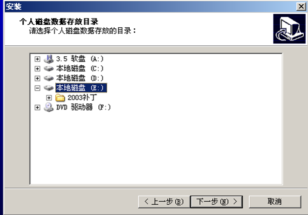
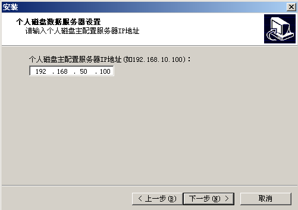

 1.  主配置服务器的安装

运行  安装主配置服务端，安装时直接点击【下一步】即可完成主配置服务端的安装。

<blockquote class="success">

</blockquote> 

 
2.  从配置服务器的安装：

> 从配置服务端在安装时需要输入主配置服务器的IP地址，其它操作与主配置服务器安装相同。

3.	数据服务器的安装：
运行 安装数据服务端，安装时需选择个人磁盘数据存放目录，如下图

输入主配置服务器IP地址，如下图

