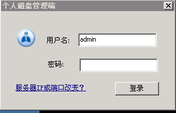
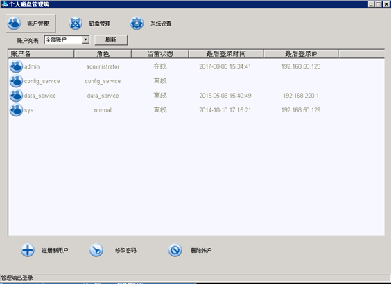
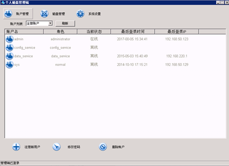
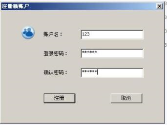
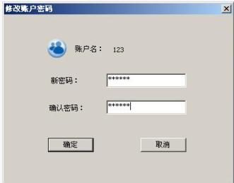
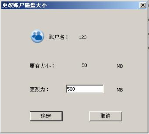
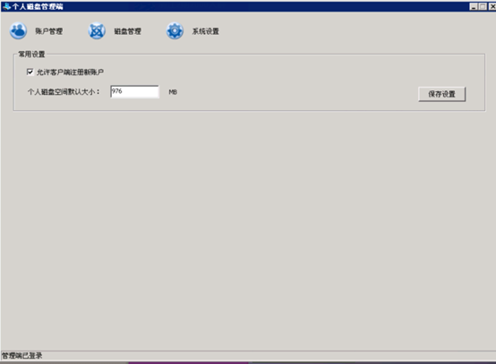
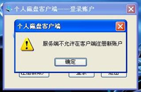
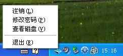

<blockquote class="info">
	关于个人磁盘管理系统
</blockquote>

<blockquote class="success">
	个人磁盘系统是和信下一代云桌面系统中一个独立的系统，在和信下一代云桌面系统中，用户可以申请或登陆已有账户进行使用，用于存放用户临时数据或个人资料等用途，
</blockquote> 

1.  登录

> 登录个人磁盘管理系统，默认用户：admin	123456
> 

 
2.  个人磁盘主界面

> 主界面上工具栏中分三个项，账户管理、系统设置、维护工具

1）账户管理

|功能|描叙|
|---|---|
|1、账户管理 | 用于对系统中所有账户安全管理(如图示账户管理主界面)|
| | |
| 1.1注册新账户：|	添加新账户，可以通过个人磁盘系统服务端直接添加或在服务端允许情况下客户端注册完成，如下图示例为服务端添加； |
| | |
|1.2	修改账户密码 |修改当前选定账户登录密码；如下图示设置新密码界面|
| 1.3更改磁盘大小|根据实际需要对当前选定账户的磁盘容量大小进行更改，但请注意，更改扩大磁盘容量后磁盘中原数据不丢失，更改缩小磁盘容量后原磁盘中数据将丢失，请在更改磁盘容量大小前谨慎操作，如下图示为扩大磁盘容量 |
| | |
| 1.4删除账户|<blockquote class="danger"> 删除当前所选账户，删除账户后账户中数据将不存在且无法恢复，请谨慎操作，提示如下图警告提示</blockquote> |
| | |

2）系统设置

|功能|描叙|
|---|---|
|2.1允许客户端注册新账户|通过此项控制用户是否能直接在客户端机器注册新账户，如下图示例为客户端机器无法注册界面|
|||
|2.2程序启动时自动清理无效虚拟磁盘|控制程序是否在启动时清理长期未使用、无效账户或注销时未能正常注销的虚拟磁盘|
|2.3磁盘空间大小设置|设置新注册用户在默认状态下的磁盘容量大小和磁盘镜像文件默认存储路径|
|||
||| 
3.  在客户端机器上，个人磁盘登录状态可以通过系统桌面右下角查看，如图；

4.  在客户端机器，可以对用户个人磁盘进行基本操作(包括注销、修改密码、查看磁盘、退出)，如图；
