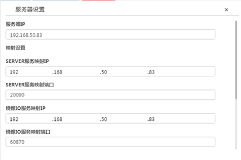

<blockquote class="success">
	关于服务器设置
</blockquote> 
 
>    服务器设置是针对镜像推送功能以及服务器本地多网卡绑定所做的高级设置，可以同时完成服务器外网映射IP与端口的配置，以及服务器本地多网卡绑定的配置，以实现广域网环境下上级服务器与下级服务器的通讯和服务器本地多网卡绑定以及解绑功能。

 
1. 如何配置服务器设置

> 在管理端左侧多服管理中，右键选择需要配置的服务器，选择服务器设置选项即可打开服务器设置界面（如下图所示），该界面中可以同时设置服务器IP与端口映射以及服务器网卡绑定解绑功能。

2. 注意

> 服务器映射设置中分别填写server与镜像IO映射到外网的IP与端口，以实现与下级服务器相关服务通讯，以及广域网下终端与服务端的通讯。
<blockquote class="success">
 注：其中server服务与镜像IO服务最好使用默认端口！在广域网环境下使用需要将服务器以下	端口映射到公网：6903 5400 5500 20090 20093 60870，以保证系统功能能正常使用！ 
</blockquote> 

> 网卡绑定设置中可以对当前服务器所使用网卡进行绑定以及解绑操作，只有绑定的网卡才能正常在系统中使用并提供网络服务。

<blockquote class="warning">
注：服务器主网卡默认绑定且不能解绑，解除绑定的网卡下有终端也无法解绑！ 
</blockquote> 
