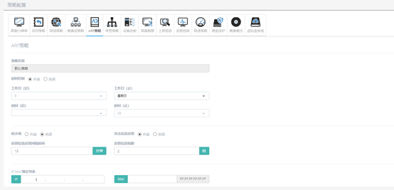
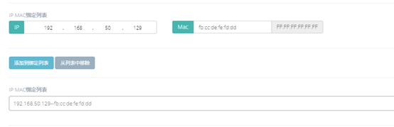

<blockquote class="info">
什么是ARP策略
</blockquote> 

> ARP策略开启后将会拦截当前局域网中对终端的ARP攻击包，并将终端的ARP攻击信息反馈到服务端。

 
 

 
1.  如何配置ARP策略

> 在管理端系统服务中选择策略配置，在ARP策略菜单界面中可以对ARP策略进行配置，可以设置是否反馈攻击信息，并且反馈攻击信息的时间间隔和信息组数，如下图

<blockquote class="success">
在该策略中还可以设置IP &MAC绑定列表，将终端的IP与
 MAC地址绑定，以防止局域网中出现伪造IP或者MAC发送攻击包的情况，设置如下图：
</blockquote> 

 
 