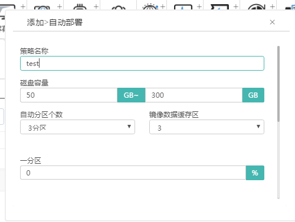
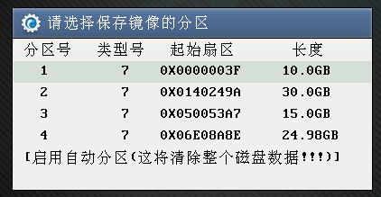

<blockquote class="info">
	什么是自动部署
</blockquote> 

> 自动部署是针对磁盘容量在策略范围内的客户机，自动对磁盘进行分区并且根据选择的分区进行缓存。客户机启动后系统会检测到客户机磁盘容量，并且根据管理端配置的自动配置策略进行全自动化操作。

* * * * * 
 
1.如何配置自动部署策略

> 在管理端界面右键点击自动部署，新建自动部署策略，配置磁盘容量范围、自动分区个数、数据镜像缓存区以及每个分区的大小，如下图所示：
> 

2.如何应用自动部署策略
|条件|事件|
|---|---|
|1、客户机磁盘未初始化|如果加入的客户机磁盘是未初始化的，并且在自动部署策略磁盘容量范围内，系统会自动根据策略配置将磁盘分区并且缓存镜像数据，客户机启动后会有自动初始化的过程，如下图：|
||| 
|2、客户机磁盘已分区|如果加入的客户机磁盘是已经分区使用过的，而且在自动部署策略磁盘容量范围内，客户机就会出现如下所示选择界面，用户可以选择已经存在的分区来缓存数据，也可以启动自动部署来完成分区以及选择缓存分区的操作；| 
||| 
|||  
<blockquote class="warning">

如果加入的客户机磁盘是已经分区使用过的，但是不在自动部署策略磁盘容量范围内，这个时候客户机启动不会出现启动自动分区选项，只能选择一个已经存在的分区缓存数据；
</blockquote> 