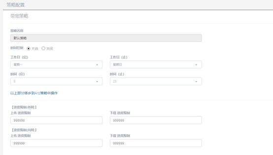
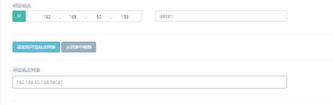

<blockquote class="info">
什么是带宽策略
</blockquote> 

> 带宽策略是用来对终端内外网上传以及下载进行限速的功能策略。

 
 

 
1.  如何配置带宽策略

> 在管理端系统服务中选择策略配置，在带宽策略菜单界面中可以对带宽策略进行配置，可以对终端的内外网上传以及下载速度进行针对性的限制，默认速度为‘999999’，表示不限速，如下图所示：

<blockquote class="success"> 
在该策略中还可以设置可信站点，添加到可信站点列表中的机器与终端通信不会有速度限制，设置如下图：
</blockquote> 

<blockquote class="warning"> 
注：带宽策略需要在开启ARP策略后才能生效！
</blockquote> 