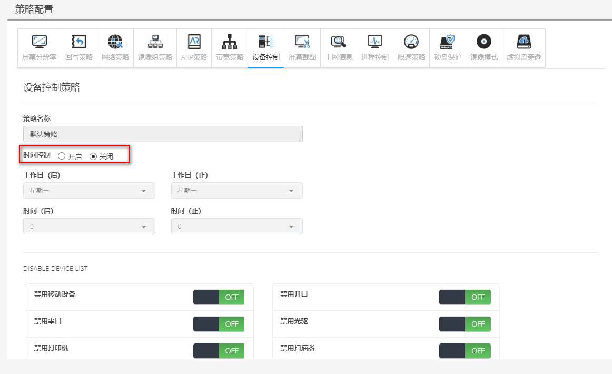
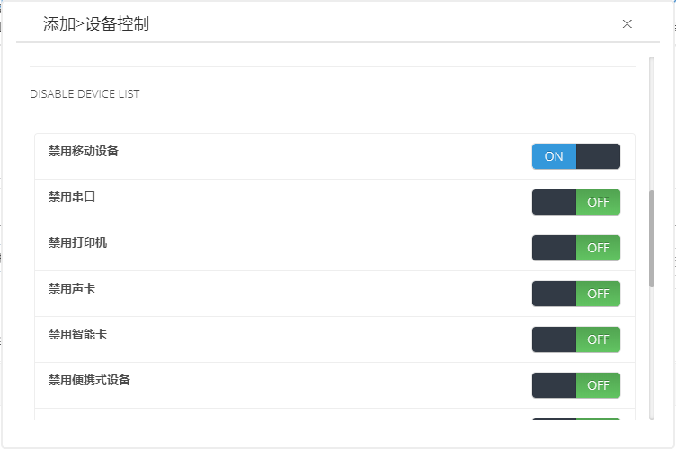

<blockquote class="info">
	什么是设备控制
</blockquote> 

<blockquote class="success">
设备控制是用于限制终端外设连接权限的策略，主要含可移动存储设备、光驱等外设；
</blockquote> 

* * * * * 

1. 默认设备控制策略（默认关闭）

2. 添加设备控制策略
<blockquote class="success">
如图，在创建新策略中，可以将需要禁用的外设项目设置为开启，即可生效；
</blockquote> 

<blockquote class="warning">
	 提示：禁用设备项与禁用设备相对应，其中禁用移动存储设备不包含USB鼠标与键盘，禁止修改IP开启后，客户机无法在本地连接中修改IP信息，禁用硬盘开启后，客户机将无法识别不存在缓存分区的硬盘；
</blockquote> 