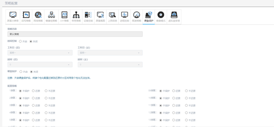

<blockquote class="info">
	什么是硬盘保护策略
</blockquote> 

> 硬盘保护是针对客户机的硬盘生效的策略，主要功能是保护客户机硬盘上的数据，任何对硬盘数据的添加、删除以及修改都将被保护而无法正常生效。
 
 

 
1. 如何配置硬盘保护策略

>在硬盘保护策略中，通过设置硬盘上的分区，来针对分区对硬盘进行保护，如下图所示；
>
>

<blockquote class="warning">
    设置为还原的分区，任何对该分区所做的操作，重启后就会还原；设置为不还原的分区，对该分区所做的操作会保留下来，但是可用清除不还原数据将保留的操作清除。
</blockquote> 

 
2. 如何应用硬盘保护策略

> 1)	默认策略针对所有客户机进行管理，包含已存在客户机和新加入客户机，在无子策略情况下，所有客户机都受到默认策略的限制；
> 2)	新建策略针对所新建监控策略中包含的客户机，对策略以外的客户机无限制；可根据实际情况对实际环境中的客户机进行区域管理；
